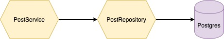
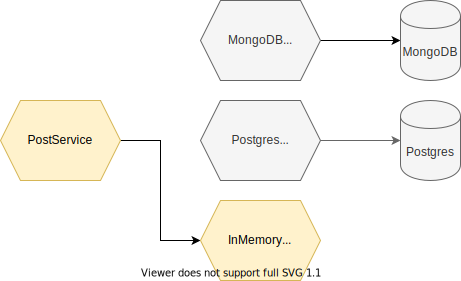

Dependency Injection(DI)을 한국어로 의존성 주입이라고도 하지만 실제로는 DI라고 했을때 우리는 DI Framework/Library 를 의미합니다. 우선 Dependency Injection 이 무엇인지 에 대해 설명하겠습니다.

예를 들어 `PostService` 는 블로그 포스트를 작성해주는 서비스가 있다고 가정합니다.

```golang
type PostService interface {
  CreatePost(Post) Post
}
```

이때 우리는 블로그 포스트를 데이터베이스에 저장하고 싶습니다. 그러기 위해서 `CreatePost(Post)` 함수 안에서

1. 데이터베이스에 연결하고
2. Post 를 INSERT 한다.

이런식으로 할 수 도 있습니다. 하지만 이런식으로 하기보다는 비지니스 로직과 데이터베이스를 다루는 코드를 분리하여 데이터베이스에 저장하는 코드는 `PostRepository` 에 대행시킬 것입니다.

```golang
type PostRepository interface {
  StorePost(Post) bool
}
```



즉 보시다싶이 `PostService` 가 `PostRepository` 에 의존하고 있습니다.
그러면 `PostService` 를 생성하기 위해 다음과 같은 코드를 작성할 것입니다.

```go
func NewPostService(repo PostRepository) PostService {
	return &postService{
		Repo: repo,
	}
}
```

이게 Dependency Injection 입니다. 이때 만약 Postgres가 아니라 Sqlite 나 심지어 메모리에 저장하고 싶으면 어떻게 될까요? 그에 해당하는 PostRepository 객체를 바꿔껴주기만 하면 됩니다.



이렇게 의존성이 간단하면 Dependency Injection 프레임워크가 없더라도 손으로 Dependency Injection 설계도 가능합니다. 하지만 이렇게 의존하는 서비스가 많아진다면?

```go
func NewPostService(someService SomeService, otherService OtherService, repo PostRepository, ...) {
  // ...
}
```

```go
// main.go
func main() {
  otherSerivce := NewOtherService("secret")
  someService := NewSomeService(otherService)
  postRepository := NewPostRepository("dburl")
  potService := NewPostService(someService, otherService, postRepository)
  // ...
}
```

일일히 손으로 바꿔주는게 매우 귀찮고 손이 많이갑니다. 순서도 맞춰줘야 되고 argument 위치나 귀찮은게 한두가지가 아닙니다. 이걸 자동으로 해주는 것이 바로 Dependency Injection Framework 이고 Go 에서는 [wire](https://github.com/google/wire) 와 [fx](https://github.com/uber-go/fx) 가 있습니다.

## 준비물

여기서는 구글의 [wire](https://github.com/google/wire) 를 사용하도록 하겠습니다.

```shell
go get github.com/google/wire/cmd/wire
```

## 프로젝트 구조

```
.
├── cmd
│   └── server.go
├── go.mod
├── go.sum
├── module
│   └── wire.go
└── post
    ├── postrepository.go
    └── postservice.go

3 directories, 6 files
```

각 `postservice.go` 와 `postrepository.go` 파일은 이전에서 본것과 동일합니다.

```golang
// postservice.go
package post

// (skip)

// PostService 를 생성하는 factory function
func NewPostService(repository PostRepository) *PostService {
	return &PostService{Repo: repository}
}
```

```golang
// postrepository.go
package post

type PostRepository interface {
	StorePost(Post) bool
}

type InMemoryPostRepository struct {
	cache map[string]Post
}

func (i *InMemoryPostRepository) StorePost(post Post) bool {
	i.cache[post.id] = post
	return true
}

// 인메모리 포스트리포지토리를 생성하는 팩토리 함수
func NewInMemoryPostRepository() PostRepository {
	return &InMemoryPostRepository{}
}
```

이제 `module/wire.go` 파일은 다음과 같습니다.

```golang
//+build wireinject  <--- 매우 중요

package module

import (
	"example/post"
	"github.com/google/wire"
)

func InitializePostService() *post.PostService {
	wire.Build(post.NewInMemoryPostRepository, post.NewPostService) // <-- Factory 함수들
	return &post.PostService{} // <-- Return Type을 마추기 위한 더미로 중요하지 않음
}
```

이제 shell 에서 `wire` 커맨드를 치면 코드가 생성이 됩니다.

```shell
wire module/wire.go
```

아래는 생성된 코드입니다. `PostRepository` 와 `PostService` 가 올바른 순서로 생성된 것을 볼 수 있습니다.

```golang
func InitializePostService() *post.PostService {
	postRepository := post.NewInMemoryPostRepository()
	postService := post.NewPostService(postRepository)
	return postService
}
```

자세한 내용은 https://bit.ly/2Sqdnws 에 참여하셔서 문의주세요 😄
