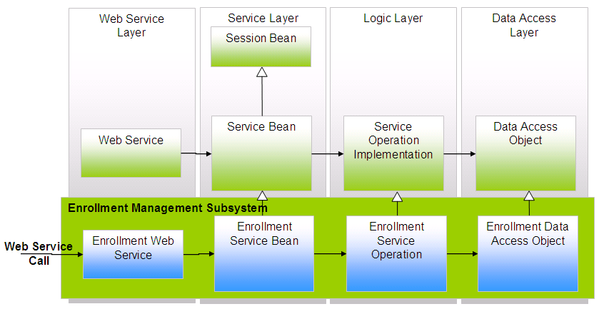
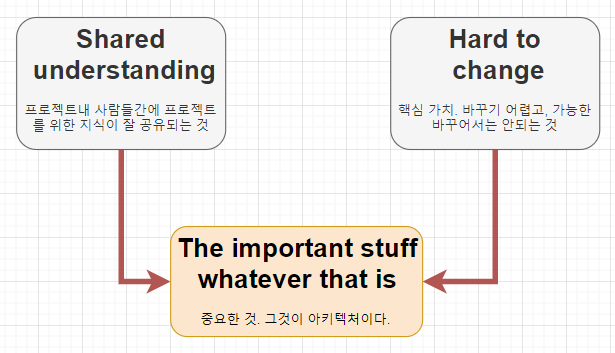
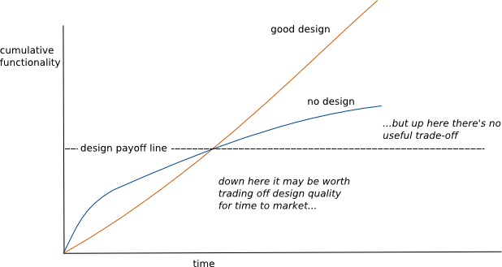

<figure style="display: flex; flex-direction: column; align-items: center" alt="architecture">
  
  <figcaption>Photo by <a href="https://unsplash.com/@joelfilip?utm_source=unsplash&amp;utm_medium=referral&amp;utm_content=creditCopyText" style="user-select: auto;">Joel Filipe</a> on <a href="https://unsplash.com/s/photos/software-architecture?utm_source=unsplash&amp;utm_medium=referral&amp;utm_content=creditCopyText" style="user-select: auto;">Unsplash</a></figcaption>
</figure>

마틴 파울러가 10 여분간 압축하여 이야기한 소프트웨어 아키텍처에 대한 생각을 유튜브를 통해 보고, 유튜브에 언급된 칼럼까지 읽고 나서 정리를 해보고 싶어졌다.

### 참고 링크

유튜브 링크: https://youtu.be/4E1BHTvhB7Y
유튜브에서 언급한 칼럼: https://martinfowler.com/ieeeSoftware/whoNeedsArchitect.pdf
Design Stamina Hypothesis: https://martinfowler.com/bliki/DesignStaminaHypothesis.html

## TL;DR

`소프트웨어 아키텍트`는 팀 내의 가장 노련한 개발자이다. 요구사항을 받아서 어떤 콤포넌트와 인터페이스로 구성할지를 디자인하여 개발팀에 공유하고 합의를 이루면 그것이 바로 `아키텍처`이다. 이러한 아키텍처는 한번 정하면 바꾸기가 힘든 것들을 말한다. 그렇기에 핵심가치를 담고 있기도 하며 개발에 참여하는 모든 이가 이해하고 합의하는 최소한인 것이다.

아키텍트는 `등반에서의 가이드`와 같다. 개발팀을 이끌면서 가르쳐 전체 구성원의 역량을 끌어올리고, 난관에 부딪힐때 의지할 수 있는 존재이다. 개발팀과 프로젝트가 돌아가는 상황을 잘 알고 있으며, 작은 문제들을 발견할때마다 미리미리 대응해서 커지지 않게한다. 이를 위해서는 `개발팀 전체와 긴밀하게 협업`을 해야 한다.

아키텍처란 바꾸기 힘든 것이다. `바꾸지 힘들 수록 복잡도를 높인다.` 아키텍처라 이름 붙일 만한 것이 적을 수록 좋은 것이다. 바꾸기 힘든 것을 바꾸기 쉽게(=유지, 보수, 기능추가가 쉽게) 만들어주면 그것은 더 이상 아키텍처가 아니다. 아키텍트는 아키텍처를 줄이려 노력하는 사람이다.

고객의 눈에 보이지 않는 이러한 아키텍처는 품질에 투자할 수록 = 유지, 보수, 기능 추가가 쉽도록 개발할 수록 조금 긴 시각에서 보면 경제적으로 큰 이익이 된다.

## 소프트웨어 아키텍처란 뭘까?

소프트웨어 아키텍처란 뭘까? 마틴 파울러는 랄프 존슨을 통해 얻은 통찰로 아래 둘로 표현한다.

1. 노련한 개발자가 나눠주는 시스템 디자인에 대한 이해 (Expert developers' shared understanding of the system design)
2. 변경하기 힘든 것들 (The decision that are hard to change)

### 1. Expert developers' shared understanding of the system design

고객과 고객의 요구사항을 구현하는 개발자로 나누어 보자.
고객은 아키텍처를 알지도 못하고 관심도 없다. 요구한 대로 돌아가기만 하면 된다. 바꿔 말하면 개발자만 관심있는거다.

요구사항을 받으면, 팀에서 짬밥이 많은 개발자들이 이를 만족하려면 어떻게 구현해야할지 고민할 것이다.
대략 큰 덩어리의 콤포넌트들이 떠오르고, 그것들을 연결하는 인터페이스를 요래조래 하면 되겠다 싶을 거다.
그러면 그걸 개발팀원들에게 공유한다. 그게 `아키텍처`다.

그러면 개발팀 내에서 어떤 합의가 이루어지게 된다. 콤포넌트와 인터페이스가 이렇게 되어야는 거구나 하는 합의이다.
왜 합의가 필요할까? 그만큼 중요한 것이기 때문이고, 모두가 이해하고 그에 맞게 구현해야 하기 때문이다.
아키텍처는 `무엇이 되었든, 중요한 것`에 관한 것이다.

아키텍처 하면 떠오르는, 아래와 같은 다이어그램과 같은 형식은 이런 공유의 결과로 만들어지는 것들을 표현(representation) 한 것 뿐이다.

### 2. The decision that are hard to change

아키텍처는 프로젝트 시작할때 제대로 알고 결정했어야 하는 거라는 말이 있다.
이걸 다르게 말하면 `바꾸기 어려운 것`을 말한다. 쉬우면야 앞의 결정을 번복하고 새롭게 바꾸면 되니깐 말이다.
핵심적인 가치를 지닌 것이고, 바꾸기 힘든 것이기에 가능한 바꾸지 않으려 하는 것이다.

## 그래서 아키텍처가 뭔데?

1번과 2번을 모아서 좋은 소프트웨어 아키텍처를 정리해본다.
프로젝트에서 추구하는 핵심가치, 그래서 바꾸기 어렵고 가능한 바꾸지 않으려 하는것이며, 그렇기에 프로젝트에 참여한 사람들 중에서 제일 노련하고 잘하는 사람이 정리하고 공유해주면 팀의 모든 사람들이 이를 잘 이해하고 맞게 만들어가야 하는 것이다.

이 둘을 합쳐서 한 단어로 말하자면 아키텍처는 `모든 중요한 것들`이라는 말이 된다.
쉽게 바꿔서는 안되고, 충분히 이해하고 만들어야 하는 중요한 것들이다.

## 아키텍트의 역할은 무엇일까?

아키텍처에 대해 어느정도 정의가 되었다. 그러면 아키텍트는 뭘까? 칼럼에서 다음과 같이 언급되어 있다.
우리가 흔히 생각하는 아키텍트는 대략 이럴 것이다.

- 엄청나게 중요한 결정을 한다. 그런데 그 결정대로 되어야 한다 생각하지 팀원들이 그걸 감당할 수 있을지는 상관없다.
- 이 결정은 가능한 빨리 내려야 한다. 그래야 다른 팀원들이 따라오니깐
- 이러다보니 `아키텍트의 가치는 그가 내리는 결정의 수에 반비례 한다`는 경험칙이 나오게 된다.

그러면 제대로 된 아키텍트는 뭘 어떻게 하는 사람일까?

- 이슈들을 발견하고 큰 문제가 되기전에 미리미리 조치하는 사람이다.
- `그러려면` 프로젝트 전반이 어떻게 돌아가는지를 잘 알아야 한다.
- `그러려면` 팀원들과 소통과 협력이 잘 되어야 한다.
- 무엇보다 중요한 것은 개발팀의 `멘토`가 되어야 한다는 것이다.

칼럼에서는 이런 사람에게 아키텍트보다는 `가이드`라는 표현이 더 낫다 이야기한다. 경험이 풍부하고, 실력이 남달라서 다른 멤버들을 가르쳐주어 개발팀 전체의 수준을 높여주고, 그래서 더 높은 요구사항을 감당할 수 있게 해주며, 어째야 할지 감이 안오는 문제를 만났을때는 의지가 될 수 있는 사람

## 아키텍트의 또 다른 역할 - 소프트웨어 아키텍처 제거반

Enrico Zaninotoo 라는 사람은 Agile을 되돌리기 힘든 것들(irreversibility)을 줄여서 복잡성(complexity)을 줄이는 것이라고 말했다. 복잡성을 줄이면 어떻게 될까? 로버트 마틴, 밥 아저씨가 말한 소프트웨어 아키텍처의 정의, 목표가 떠오른다. `적은 인력으로 유지 보수하기 쉽게 되는 것`이다.

앞서 정의에서 아키텍처는 되돌리기 힘든거라고 했다. 그렇다면 그걸 되돌리기 쉽게 만들 수 있다면 그건 더 이상 아키텍처가 아닌게 되고, 소프트웨어의 복잡도를 줄여주게 되며, 그 결과로 적은 인력으로 유지 보수하기 좋은 소프트웨어를 만들게 되는 것이다.

아키텍트는 아키텍처라 불러야 마땅한 것들을 줄여나가는 사람이다.

## 소프트웨어 품질과 돈

좀 더 나은 품질의 소프트웨어를 고집하는 것은 장인정신 처럼 보이고, 당장의 time to market (시의 적절하게 제품을 내어놓는 것) 을 위해 품질을 희생시키는 것은 회사의 이익을 위한 선택처럼 보인다. 같은 가격, 같은 기능을 가진 제품을 개발자의 시간을 적게 들이고 팔면 이익인것 아닌가? 짧은 시각으로 보면 맞는 말처럼 보인다.

반복해서 언급하게 되지만 로버트 마틴이 말하는 좋은 아키텍처는 적은 인력으로 유지 보수할 수 있는 아키텍처이다. 좋은 아키텍처, 좋은 품질의 소프트웨어란 `출시한 이후에 지속적으로 유지 보수 및 새로운 기능을 넣기 좋은 소프트웨어`인 것이다. 이게 바로 회사의 이익, 그리고 고객의 이익이 되는 것이다.

아래 그림의 good design 을 보자. 초기에 투자를 해서 좋은 소프트웨어 아키텍처를 구축했더니 - 노련한 개발자가 핵심 가치를 놓치지 않고, 최소한의 아키텍처로 디자인 한 다음, 모든 팀원이 이해하고 개발할 수 있게 만들었더니 - 그 기반위에서 새로운 기능을 넣어주거나 유지하고 보수하기가 훨씬 쉬워진 것이다. 돈과 직결되는 생산성이 비약적으로 좋아진 것이다.

[^stamina]

[^stamina]: 이미지 출처: https://martinfowler.com/bliki/DesignStaminaHypothesis.html
