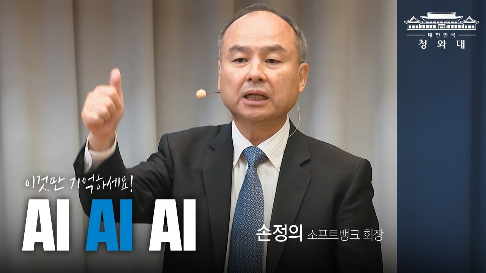

## AI AI AI!!!

그야말로 AI의 시대입니다. 뉴스, 유튜브, 페이스북에 AI에 대한 이야기가 안나오는 날이 있을까 싶을 정도로 AI의 시대에 살고 있는거 같습니다. 그렇기 때문에 우리는 하루하루 마음을 졸이며 살고 있죠. 이 두려움은 업종, 직군을 따지지 않고 깊숙히 스며드는 것 같습니다.

이런 이유로 AI에 대한 책이 많이 나옵니다. 특히 인공지능쪽을 잘 모르는 분들을 위한 책들도 많이 나오고 있습니다. 그런 책들의 흐름은 대부분 이런 식입니다.

- 선형회귀를 통한 예측
- 로지스틱 회귀 예측
- 랜덤포레스트를 통한 분류
- 머신러닝에서 더 깊숙히 들어간 딥러닝 모델.

아무것도 모르던 시기엔 이게 전부인줄 알았습니다. 그런데 그렇지 않더라고요.

## What is Data Analyst? Who is Data Analyst?

비전공자에서 IT쪽으로 오신 분이라면 공감하실지 모르겠는데, 손정의가 아무리 'AI AI AI!!!!!'라고 외쳐도 결국엔 알고리즘, 운영체제, 수학, 통계학과 같이 기본기가 중요하고 실제로 기업에서도 이런 기본기를 갖춘 사람을 선호한다는 걸 알게 됩니다. 프레임워크를 쓰는 건 어쩌면 그에 비하면 너무 간단한 문제일 수 있으니까요.

그래서 저는 고민을 많이 하고 있습니다. 데이터분석 입문 수업을 광고하는 곳에서는 데이터 분석가가 되는 게 쉬우면서도 연봉을 올리기 좋다고 하지만, 실제로는 그렇지 않거든요.

단순히 pandas써서 데이터 전처리 조금 할 줄 알고, sklearn과 같은 머신러닝 프레임워크 조금 다룰 줄 안다고 해서 데이터 분석가가 될 수 있다고 할 수는 없으니까요.

그럼 데이터 분석가란 무엇일까요? 데이터 분석가란 누구인걸까요? 좋은 데이터 분석가란 어떤 사람일까요?

## Find the Essence. Prove by Action


The only thing that doesn't change is the fact that it changes


사실 저는 저 질문들에 대한 답을 아직까지 잘 모르겠어요. 답을 찾아가는 과정인 것 같다는 생각을 하기도 해요. 가끔 보면 저 질문들에 대한 답을 안다는 듯 잘난척을 하는 글들이 보이곤 하죠. 정말 잘 하시는 분들인 경우도 있지만, 광고글이거나 잘 모르는데 잘 아는척 하는 글을 볼 때가 많이 있어요.

모든 IT분야가 그렇듯, 데이터분석 쪽도 계속해서 빠른 속도로 변화가 일어나고 있어요. 그렇기 때문에 혼란스러운게 아닐까 생각이 들어요. 과거, 데이터분석은 특별한 훈련을 받은 사람들만 했다면 이제는 점점 더 누구나 쉽고 간단하게 분석을 할 수 있고 워크플로우까지 만들 수 있는 시대가 왔으니까요.

그렇다 해도 데이터분석가에게 본질적으로 변하지 않는 요구능력은 데이터를 바라보는 능력이지 않을까요? 물론 데이터를 바라본다는 건 비즈니스 관점으로도 바라볼 수 있고, 백엔드 개발 관점으로도 바라볼 수 있고 여러가지 관점으로 바라볼 수 있겠죠. 하지만 데이터 분석가에겐 기본적으로 통계학적 관점이 필요하지 않을까 생각이 들어요. 조금 더 엄격하게 데이터를 바라볼 수 있게 해주니까요.

그렇기 때문에라도 통계공부는 해야 하는데 손이 잘 안가긴 하죠.

이 책은 이런 여정을 떠나는 사람이 잠시 쉬며 훑어볼 용도로 괜찮은 책이에요. 아예 모르는 사람에게는 적합하지 않고, 익히는 과정에 있는 사람들이 이런게 있구나 하는 전체적인 조망을 보는 데 유용한 책. 그런 책이에요.

주말 하루 시간을 잡으면 금방 읽을 수 있는 책이라 너무 무겁지 않아서 좋았어요.
