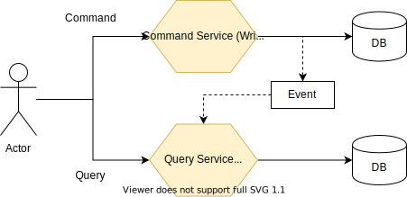
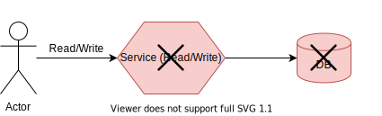

제가 서비스를 만들 때 가장 좋아하는 패턴인 <abbr title="Command Query Responsibility Segregation">CQRS</abbr> 에 대해서 적어보겠습니다.

## CQRS란?

원 단어를 보면 어려우 것 같지만 쉽게 얘기하면 `read` 와 `write` operation 을 나누어서 서비스를 만드는 것을 의미합니다. 특히 일반적으로 event sourcing 과 함께 구현됩니다.

## 왜 사용하는가?

쓰는 작업과 읽는 작업이 분리가 되있을 경우 (많은 서비스가 그러합니다) 한 서비스에서 둘다 처리할 경우 유용합니다. 만약에 한 서비스에서 처리하는데 쓰는 작업에 어떤 문제가 발생할 경우 읽는 작업 또한 불가능해지게 될 것입니다.

또 쓰는 작업은 트래픽의 $0.01\%$ 정도 밖에 안되고 읽는 서비스가 대부분의 트래픽을 차지할 수 도 있습니다.

## 예시

CQRS 을 [YouTube Premium](https://youtube.com/premium) 서비스를 사용해 예시를 들어보도록 하겠습니다.

### Functional Requirements

- 유저는 Youtube Premium 을 signup 할 수 있습니다.
- YouTube Premium 유저는 광고를 스킵합니다.

위 요구사항을 통해 다음과 같이 두개의 서비스로 나타낼 수 있습니다.

- Premium Service
  - 실제 Premium 회원 가입을 받는 서비스
- Premium Access Service
  - Premium Access 를 가진 유저인지 확인하는 서비스

어느 날 무슨 이유로 Premium Service 가 다운 됬을 경우에도 기존의 Premium User들은 아무 문제 없이 광고 없이 동영상 시청이 가능합니다.

실제로도 이런 CQRS 패턴을 사용해 구현되어 있습니다.

## Sync

그럼 이제 문제는 Query의 DB와 Command를 받는 DB의 consistency 를 어떻게 유지하는지가 관건일 것입니다. 이 문제는 [event sourcing](https://microservices.io/patterns/data/event-sourcing.html) 패턴을 사용합니다. 이벤트소싱에 대해서는 다음 포스트에서 쓰도록 하겠습니다.
