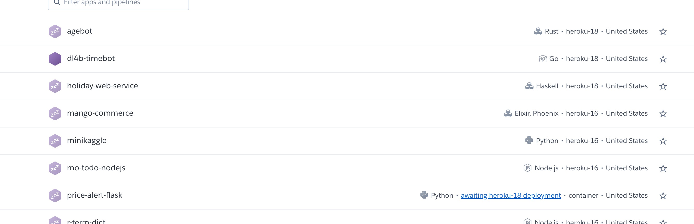
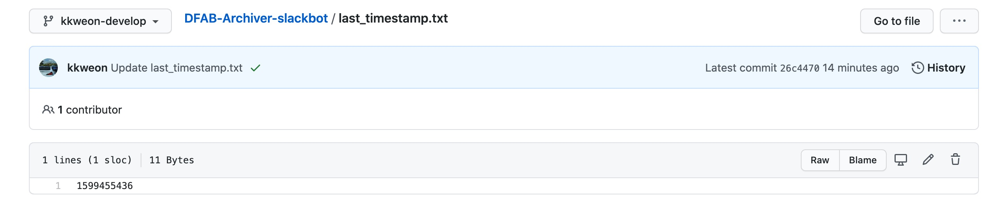
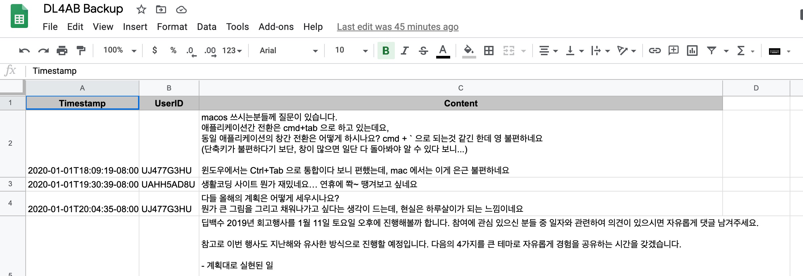
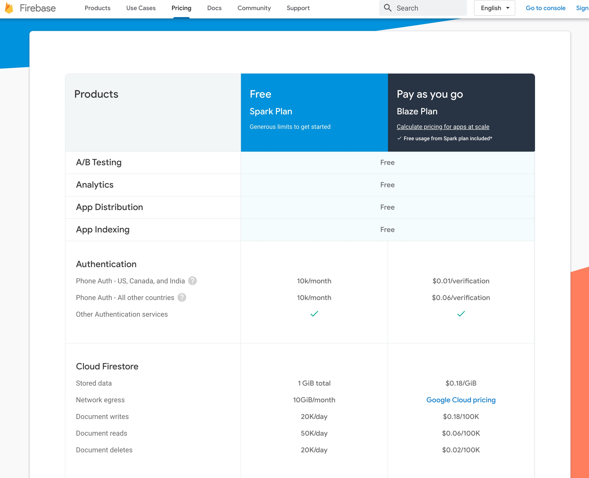
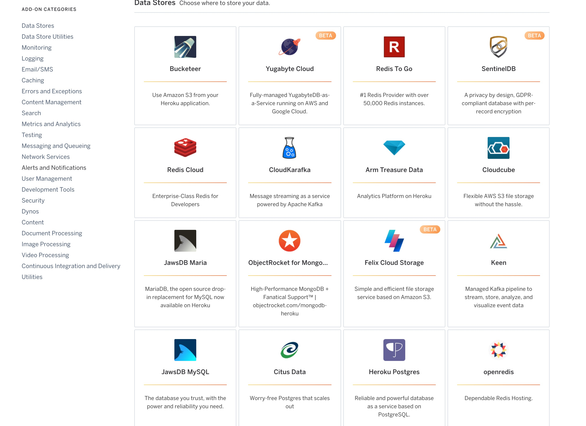
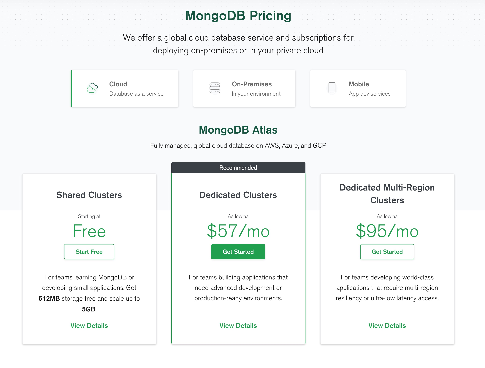

많은 기업에서 채용을 위한 조건으로 포트폴리오를 내걸고 있습니다. 그래서 보통 열심히 코딩을 하며 개인 프로젝트를 수행합니다. 그런데 포트폴리오 소스코드를 만들었다 해도, 다른 분들에게 보여줄 수 없다면 큰 의미가 없을겁니다. 그래서 호스팅을 해야 하는데, 서버가 24시간 돌아가야하는 호스팅의 특성상 무료가 아닌 경우가 많습니다.

개인프로젝트들을 무료로 호스팅할 수 있는 방법들을 무엇이 있을까요? 예를 들어 24시간 상주해있어야 되는 봇도 무료로 배포할 수 있습니다. 예를 들어 저희 딥백수 커뮤니티에서는 여러 봇들이 상주하고 있는데 소수를 제외하면 전부 무료로 운영하고 있습니다. 또한, 개인 프로젝트들 또한 무료로 전부 데모를 호스팅하거나 공식문서를 무료로 호스팅하고 있습니다.

이 글에서 프로젝트들은 다음과 같이 분류하고 있습니다.

1. CSS, HTML, JS 로만 이루어진 프론트엔드
1. 일정한 스케쥴에 따라 작동하는 크론잡
1. 백엔드 서비스가 필요한 경우
1. 데이터 저장이 필요한 경우

한가지 범위에만 속하지 않을 수 도 있습니다. 예를 들어 백엔드 서비스가 필요하면서 데이터 저장이 필요한 경우는 꽤 자주 있는 경우입니다. 또한 당연히 프로젝트가 어느정도 규모로 커지게 되면 무료로는 한계가 있습니다.

## 프론트엔드

배포하고자 하는 프로젝트가 전부 스태틱 파일이라면 이런 경우에 속합니다. 이런 경우 [GitHub Pages](https://pages.github.com/) 를 통해서 배포해주는게 제일 간편합니다. 예를 들어 현재 이 블로그는 https://github.com/dl4ab/dl4ab.github.io/tree/master 에서 GitHub pages 로 호스팅 되고 있습니다.

예를 들어 오픈소스로 라이브러리를 만든다면 라이브러리에 대한 문서를 GitHub Pages 를 통해 배포하는 것이 일반적입니다.

혹은 [Netlify](https://www.netlify.com/) 를 이용하는 방법도 있습니다. 하지만 Netlify 는 단순히 스태틱 파일을 호스팅하는 용도로는 Overkill 에 가깝습니다. Bandwidth 제한도 존재하구요.

어떤걸 사용하던지 GitHub Actions 같은 CI 도구를 이용해 자동으로 배포가 되도록 하면 항상 최신 버전의 데모를 보여줄 수 있습니다.

## 일정한 스케쥴에 따라 작동하는 크론잡

딥백수에서는 매 1시간마다 슬랙 내용을 엘라스틱서치로 백업하는 봇이 상주하고 있습니다. 이런 식으로 매일 1시에 이메일을 보내야 한다던지 혹은 메시지를 보내야 하는 경우 [GitHub Action](https://docs.github.com/en/actions) 을 이용하면 가능합니다.

아래 예시는 딥백수 슬랙 메시지를 백업하는 스케쥴 작업으로 마지막으로 백업한 메시지의 timestamp.txt 를 깃헙리포에 저장해놓고
다음번 작업에서 그 시간부터 현재시간까지의 메시지를 슬랙으로부터 가져와 엘라스틱서치로 보내는 예시입니다.

```yaml
name: Fetch slack messages and push.

on:
  schedule:
    # every hour.
    - cron: "0 * * * *"

  repository_dispatch:
    types: manual-trigger

# A workflow run is made up of one or more jobs that can run sequentially or in parallel
jobs:
  # This workflow contains a single job called "build"
  build:
    # The type of runner that the job will run on
    runs-on: ubuntu-latest

    # Steps represent a sequence of tasks that will be executed as part of the job
    steps:
      # Checks-out your repository under $GITHUB_WORKSPACE, so your job can access it
      - uses: actions/checkout@v2

      - name: Prepare credentials.json
        env:
          PASSPHRASE: ${{ secrets.GPG_PASSPHRASE }}
        run: |
          gpg --quiet --batch --yes --decrypt --passphrase=$PASSPHRASE --output credentials.json credentials.json.gpg
      - name: Prepare token.json
        env:
          PASSPHRASE: ${{ secrets.GPG_PASSPHRASE }}
        run: |
          gpg --quiet --batch --yes --decrypt --passphrase=$PASSPHRASE --output token.json token.json.gpg
      - name: Run the docker script
        env:
          SLACK_TOKEN: ${{ secrets.SLACK_TOKEN }}
          SHEET_ID: ${{ secrets.SHEET_ID }}
          LB_IP: ${{ secrets.LB_IP }}
          ES_USERNAME: ${{ secrets.ES_USERNAME }}
          ES_PASSWORD: ${{ secrets.ES_PASSWORD }}
        run: make run_prod put_data

      - name: Commit last_timestamp.txt
        run: |
          git config --global user.name 'GitHub Action'
          git config --global user.email 'kkweon@gmail.com'
          git commit -am 'Update last_timestamp.txt'
          git push
```

## 백엔드 서비스가 필요한 경우


저희 딥백수에서는 한국 시간이 메시지로 올라오면 자동으로 미국 시간으로 변환해주는 봇이 존재합니다. 이런 경우 서버에서 메시지를 받을 수 있어야 하기 때문에 앞에 나온 방법으로는 불가능합니다.

AWS와 구글클라우드의 무료티어도 방법이지만 매우 간편한 [PaaS](https://en.wikipedia.org/wiki/Platform_as_a_service) 인 [Heroku](https://www.heroku.com/) 를 추천합니다. Docker도 지원하고 GitHub 에서 자동으로 배포되도록 연동도 쉽게 가능합니다.

또 주로 사용하는 다른 방법은 AWS Lambda 를 사용하는 방법도 있습니다. 어느정도 관대한 정책 덕분에 또 트래픽이 많지 않은 개인 프로젝트 같은 경우 서버리스가 최적이라고 할 수 있습니다. 대신 단점은 서버리스 프레임워크/라이브러리를 사용해야 된다는 점이 있으나 큰 문제는 아닙니다.

## 데이터 저장이 필요한 경우

서비스보다는 말그대로 데이터베이스만 필요한 경우, 3가지 정도로 나눠서 작업하고 있습니다.

- 위에서 나온가장 마지막 메시지의 시간을 저장하는 등의 어플리케이션 상태를 저장하는 경우
- 데이터베이스가 필요하다기보다 그냥 기록으로 저장해두는 공간이 필요한 경우
- 데이터베이스가 필요한 경우

### 어플리케이션 상태를 저장하는 경우

저희는 이런 경우 GitHub Repo 에 체크인하는 식으로 코드를 사용합니다. 말그대로 커밋하고 푸시하는 식으로 작성합니다. 특히 상태가 있는 크론잡의 경우 GitHub Action 을 통해 매우 자주 사용되는 경우입니다.



### 단순하기 기록을 저장할 필요가 있는 경우

예를 들어 메시지를 단순히 저장하고 싶은 경우 구글 스프레드시트 API 를 사용해 구글 스프레드시트를 일종의 데이터베이스로 사용할 수 있습니다. 뜨 구글 스프레드시트 앱 내부에서 크론잡 또한 가능함으로 모니터링 시스템을 구축할 수 도 있습니다.



### 데이터베이스가 필요한 경우

만약 데이터베이스가 필요하다면 2가지 방법을 사용하고 있습니다.

- 파이어베이스를 사용하거나
- [Heroku Add-ons](https://elements.heroku.com/addons) 을 사용하거나
- [MongoDB Atlas](https://www.mongodb.com/cloud/atlas) 를 사용합니다.

파이어베이스는 쉽고 간편한 대신 벤더락인(Vendor Lock-In) 이 된다는 단점이 있습니다.



두번째는 Heroku Add-ons 을 사용하는 방법입니다. Redis, Postgres, MySQL 등등 필요한 서비스를 찾을 수 있습니다.



세번째는 MongoDB Atlas 도 원래 mLab 을 통해서 Heroku Addons에서 존재했었는데 Heroku Addons 으로서 결별하여 지금은 MongoDB Atlas 플랫폼을 통해서 사용해야 됩니다. 대신에 512MB 까지 무료로 사용 가능하고 관대한 편이라 거의 자주 사용하고 있습니다.



## 마무리

무료 서비스 이외에도 사용가능한 방법으로는 라즈베리파이를 이용하는 방법도 있습니다. 라즈베리파이4는 메모리가 8GB 까지 존재하며 아이피주소는 공유기에 존재하는 [Dynamic DNS](https://en.wikipedia.org/wiki/Dynamic_DNS) 를 사용하면 됩니다. 실제로 저는 라즈베리파이에 k3s 을 이용해 쿠버네티스를 이용한 서비스들도 사용하고 있습니다. 좀더 스케일이 필요한 경우에는 저렴한 Digital Ocean 을 주로 사용합니다.

더 자세히 알고 싶으신 분은 [딥백수 슬랙](https://bit.ly/2Sqdnws) 에서 뵈요 :D
