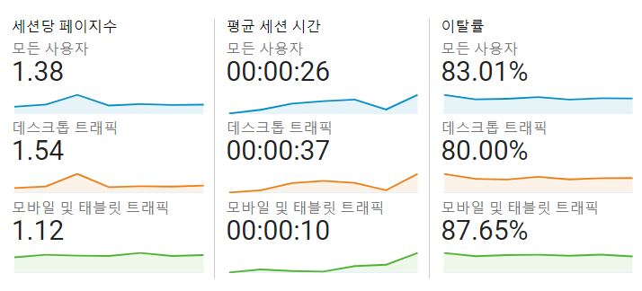

## 데이터분석(머신러닝)과 적정 기술

이제 데이터분석(머신러닝)이 중요하다는 명제는 명제가 아닌 공리가 된듯 합니다. 그래서 파이썬, R을 배우려는 사람도 많고 수학과 통계학을 배우려는 분도 많아진 거 같습니다. 물론 여기엔 저도 포함됩니다.

그런데 배워도 뭔가 빈 느낌을 받곤 합니다. 직장인이 기술을 배울 땐 재미로 배운다기보다 실무에 적용해서 성과를 올리기 위해 배우는 경우가 많은데, 쉽게 업무에 적용하기 어렵기 때문입니다. 여기에는 여러가지 이유가 있겠지만, 기술이 체화되고 익숙해지는 데 시간이 걸리는 게 첫 번째 이유라고 생각합니다. 그 다음 이유는 머신러닝이나 딥러닝을 실무에 적용하는 건 본질적으로 쉬운 일이 아니기 때문일겁니다. 데이터를 어떻게 적재하고 어떻게 뽑아낼 것이며 어떻게 학습시킬 것인지도 고민해야 하며 이런 과정을 통해 업무 프로세스를 어떻게 바꿀지도 고민해야 하기 때문에 세밀한 기획과 함께 시행착오 경험이 필요합니다.

그렇다면 데이터분석을 포기해야 할까요?

그렇지 않다고 생각합니다.

작은 성공의 경험 축적이 필요하다고 생각할 뿐입니다. 이를 위해 적합한 툴이 SQL 그리고 이번에 소개할 구글 애널리틱스입니다.
SQL이 대량의 데이터를 간단한 문법으로 조회하는 데 편리한 툴이라면, 구글 애널리틱스는 지표에 대한 감각을 길러주고 고객지향적 분석을 익히는 데 좋은 적정기술이라고 할 수 있습니다.

원래 적정기술의 의미는 **'지역사회의 인프라 수준을 고려하여 만드는 기술 또는 그 생산물을 이르는 말(출처 : 나무위키)'**이지만, 지역사회라는 단어를 이 글을 읽으시는 분 혹은 읽으시는 분이 속한 팀이라고 치환해본다면 무리가 없는 용어일 것입니다.

## It's the metrics, stupid!

병원에 가본적이 있으신가요? 병원에 가면 병에 따라 다르지만, 혈압을 체크하거나 혈당을 체크하거나 하는 등 의사들은 모두 '지표'를 확인합니다. 이를 통해 환자의 상태를 파악하고 심각한 환자의 경우 지표의 변동에 따라 시시각각 처방 또는 응급처치를 하곤 하지요. 이와 유사하게, 데이터분석을 하기 위해선 지표에 대한 지식과 감각을 길러야 한다고 생각합니다. 특히 저를 비롯한 많은 초심자분들은 화려하고 멋져보이는 다른 기법보다 먼저 기본적인 지표를 익혀야 한다고 생각합니다.

예를 들어볼까요?

같이 일하는 동료가 회사의 웹사이트 가입인원이 100만명이 넘었다는 '사실'을 여러분에게 주었을 때 여러분은 어떤 생각이 드시나요? 당연하죠. '오 힘들었겠다', '대단하네', '5천만 국민중에 100만명이나 가입했군' 기타 등등

여러가지 생각이 드시겠지만 우리가 어떤 걸 해야할지 고객이 어떤 생각을 가지고 있는지에 대해서 파악이 되시나요? 전혀 아닐겁니다. 그냥 많이 가입했다는 느낌만 줄 뿐이죠.

그런데 만약 같이 일하는 동료가 이렇게 말했다면 어떨까요? '우리 서비스를 100만명이나 가입했는데, 하루동안 우리 서비스를 이용하는 고객은 20명이에요. 우리 어떻게 하죠?' 슬슬 위기감이 들지 않나요? 왜 그럴까요? 하루 당 이용 고객이라는 비율로 측정되어 있기 때문이죠. 또한 20명이라는 숫자는 100만명과 '비교'해볼 때 너무나도 적은 숫자이기 때문에 위기감을 불러일으키죠.

이게 지표의 힘이고 우리가 분석을 통해 얻고자 하는 것입니다. 그리고 GA를 공부하는 목표이기도 합니다.

## 누구나 그럴 듯한 계획이 있어 이탈하기 전까진

마케팅 서적을 보다보면 멋있는 말들이 홍수처럼 범람합니다. 고객지향을 해야한다는 등 어떻다는 등 그런데 결국 고객이 '왜' 이탈하는지 우리가 '어떤' 액션을 취해야 하는지 모르면 그냥 뜬구름 잡는 선문답으로 끝날 가능성이 높습니다.

그래서 이 책은 구글 애널리틱스의 사용법과 함께 구체적인 조언을 건네줍니다. 책 124페이지를 보겠습니다.


홈페이지에 접속한 사용자가 한 페이지만 보고 떠나는 경우 이탈률이 증가합니다. 시작 페이지에서 이탈률이 높게 나타난다는 것은 사용자가 홈페이지를 더 볼 것이 없다고 판단했다는 것을 의미합니다. 사용자가 원하는 정보가 없는지 점검해야 합니다.

사용자가 특정 페이지에서 홈페이지를 떠나면 종료율이 증가합니다. 회원가입 페이지에서 종료율이 높게 나타난다는 것은 사용자가 회원가입을 진행하다가 홈페이지를 떠난다는 것을 의미합니다. 사용자가 회원가입을 어렵게 느끼고 있지는 않은지 점검해야 합니다.


선문답이 아닌 숫자에 기반한 액션 플랜을 우리에게 제공해준다는 걸 알 수 있습니다. 추상적인 내용으로 커뮤니케이션할 때보다 더 원활한 커뮤니케이션이 가능할거란 걸 예상할 수 있습니다.

지금 이 블로그를 운영하는 딥백수 블로그에도 구글애널리틱스가 탑재되어있습니다. 이 블로그를 통해 예를 들어볼까요?

어떤가요? 숫자만 봐도 느낌이 오시지 않나요?

- 데스크톱의 이탈율은 80%인데 모바일은 87% 이탈율을 가지고 있네? 왜 그럴까?
- 데스크톱의 세션당 페이지수는 1.54개인데 모바일은 1.12개구나.
- 데스크톱의 세션시간은 37초인데 모바일은 10초구나

그럼 이런 가설을 세워볼 수 있습니다.

- 지금은 Hexo로 블로그를 만들고 있는데, 모바일 유저가 보기 편한 다른 프레임워크를 쓰면 유저의 이탈율이 더 낮아질 수도 있겠다
- 지금 Hexo블로그 테마를 모바일 유저가 보기 편한 테마로 바꾸면 유저의 이탈율이 더 낮아질 수도 있겠다

이런 식으로 말이죠.

그리고 마찬가지로 지표를 통해 검증하거나 상황을 점검할 수 있습니다.
여기에 사용되는 지표가 꼭 이탈율일 이유는 없습니다. 다른 지표를 통해서 다른 분석을 통해서 볼 수 있죠.

이 책은 2018년에 1판이 출간되었다가 올해 2월 전자상거래, 옵티마이즈, 태그매니저 등 기능에 대한 내용을 추가한 개정판으로 다시 출간되었습니다.

저는 2판은 아직 못보고 1판을 봤는데 1판만으로도 많은 걸 배우고 실무에도 활용할 수 있었습니다.
일독을 추천드립니다.
