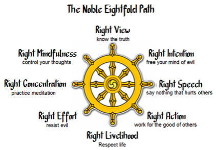

9년 전 쯤에 코이케 류노스케 스님의 책들을 몇 권을 이어 읽었었다. 최근에 명상을 접하며, 이 책들이 떠올라 다시 읽는데 9년의 세월 덕인지 나름의 이해가 늘어났다.

원시 불교는 마음의 구조에 대한 학문이고, 이를 기반으로 마음을 단련하는 방법을 알려준다.
이 책에서 스님은 불교에서 얻은 깨달음을 일터에 적용하는 법을 이야기해준다. 책에 대한 나름의 이해와 정리, 밑줄을 공유해본다.

알라딘 링크: http://aladin.kr/p/x6otp (품절)

## 머리말

```text
"...원시 불교는 '사람의 마음 구조는 어떻게 되어있는지를 완벽하게 해명한 학문과 그런 탄탄한 심리학에 기초하여
마음을 단련하기 위한 연습이라는 두 가지로 나눠져 있다." 맺음말. 245p
```

이렇게 불교에서 얻은 이해와 학습을 일에 어떻게 적용할 수 있을까?

```text
"그 순간에 해야 할 일에만 마음을 집중시키고, 마음속에서 번뇌라는 부정적인 사고가 나오지 않도록 관리할 수
있게 되었다." 8p
```

이 책에서 지향하는 궁극의 상태이다. 눈 앞의 일에 몰입하자는 것이며, 그러기 위해 몰입을 방해하는 번뇌를 멀리하고 관리하는 것도 배우자는 것이다.

## 번뇌는 어디에서 올까?

스님의 한글 번역서 각각은 약간씩 다르게 표현하고 있지만 불교에서 삼독(三毒) 이라 부르는 탐욕, 분노, 어리석음 이 세가지에서 온다.

탐욕은 더 받고 싶은 것이다.
누군가에게 인정받고 사랑받고 싶어하는 것도 탐욕이라 하겠다.

분노는 반대로 밀어내고 싶은 것이다.

어리석음은 언듯 이해가 쉽지 않은데 마음이 어지러워서 제대로 이해하지 못하는 것이라 하겠다.

### 일터에서의 번뇌

- 상사에게 잘보이고 승진하고 싶어하는 욕심에 잡아먹히면 탐욕의 번뇌가 일어난다.
- 같이 밥먹기 싫은 사람에게 차마 거절을 못하고 억지로 밥을 먹으면 분노의 번뇌가 일어난다.
- 나 같이 잘난 사람에게 이렇게 시시한 일을 시킨다고? 분노의 번뇌가 일어난다.
- 뒤에서 욕하고, 앞에서는 아첨을 하면 머리속 정보가 엉켜서 어지러워진다. 어리석음의 번뇌가 일어난다.

일터에서의 번뇌를 어떻게 다루어야 할까?
`아! 지금 탐욕/분노/어리석음의 번뇌가 일어나고 있구나!` 하고 포착하는 것이고, 그 번뇌가 걷잡을 수 없어지기 전에 통제하고 멈추는 훈련을 반복하는 것이다. 반복하면 잘하게 된다.

싫은 사람이 밥을 먹자고 하는 경우를 들어보자.

1. 싫다는 분노의 번뇌부터 인지하고 다독인 다음에, 정중히 거절해야 한다. 그래야 싫은 내색이 전달되지 않는다.
2. 같이 먹게 되었다면, 그 순간에 집중하여 열심히 함께 먹어야 한다. 먹기 싫다는 생각을 되내면 안된다.

### 마음을 통제하는 기술

마음을 통제하는 기술이란 뭘까? 우선 여기서 통제한다는 그 '마음'이란 뭘까?
대니얼 카너먼의 "생각에 관한 생각" (알라딘: http://aladin.kr/p/k1NiJ )을 읽으면 `system1`, `system2` 라는 말이 나온다.

매우 단순하게 표현하자면 `system1`은 무의식중에 튀어나오는 생각들이라보면 된다. 요즘 인터넷에서 흔한 표현이 된 "의식의 흐름"이라고 보면 되겠다. 밥먹다 말고, 가스불을 끄고 왔는지 생각하다가 결혼기념일은 언제지? 새로나온 전자제품을 사고싶다는 식으로 이리저리 튀는 생각들. `system2`는 좀더 의식적인 뇌의 활동이라고 보면 되겠다. 2 x 3 + 5 \* 6 = 이라는 문제를 풀때의 의식이다. 한 마디만 덧붙이자면 `system1`이 무조건 나쁜 것은 아니다.

마음을 통제한다는 것은 `system1`에 휘둘리지 않고, `system2`로 의식의 흐름을 통제하는 것이다.
밥을 먹으면 밥을 먹는 것에, 대화를 나누면 대화에, 일을 할때에는 일 그 자체에 몰입하며, `system1`이 머리를 들이밀고 들어와도 바로 알아채고 딱 잡아서 멀리 던져버리는 것이다.

### 번뇌의 순간을 포착하여 통제하기

```text
"언제 어느 순간이건, 주의 깊게 의식을 통제할 수 있다면 번뇌 에너지의 연쇄작용에 변화를 줘서 긍정적인 방향으로
전환시킬 수 있다." 45p
```

명상을 한다는 것은 바로 이런 통제를 하는 연습을 따로 시간을 내서 하는 것이다. 숙달이 되면 일상에 적용할 수 있게 되는 것이다.

```text
"'왜 내가 이런 일을 해야만 하는 거냐고!' 이렇게 외치고 싶은 분노의 번뇌에너지는 '이런 일을 내가 하는 것이
무슨 의미가 있지?' 라고 번역할 수 있을 것이다. 즉, 의미를 묻는다는 사실은 그 자체로 어떤 오만함을
동반하고 있다." 50p, 51p
```

이번 재독에서 가장 많이 얻은 부분이다. (오만할 근거가 하나도 없는 나인데) 회사에서 화가 올라오는 많은 상황은 바로 나의 오만함에서 비롯되었다는 것을 깨달았다. 겸손해져야 한다.

```text
"싫다는 뇌 속의 불쾌감으로 마음이 빨려 들어가는 것을 의식적으로 통제해서 어쨌든 싫더라도 청소를 시작해 보는 것은
승리로 가는 첫걸음이 될 것이다." 54p
```

업무이건 개인사이건 손이 안가고, 하기 싫고, 스트레스인 일이 있을 것이다. 계속 미루지만 마음 한구석에서 스트레스로 남아있는 녀석. 그냥 당장 하자. 그것이 통제이다. 컨트롤이다. 하기 싫은 마음을 통제, 컨트롤하며 하게 하는 것.

### 스님의 상담

**험담하는 자리에서 빠져나오고 싶어요**
거절해야 한다. 하지만 본인의 부정적인 시각, 번뇌를 잘 다스린 다음 거절 할 것

**아무런 고민이 없다는 것이 고민입니다**
집착없는 고독, 기대와 반발이 없이 온화한 상태라면 문제 없지만, 그건 아닐 것이다. 자신의 진짜 속마음과 말과 행동을 일치 시켜라

**꼴 보기 싫은 사람, 어떻게 하나요?**
분노로 나에게 불이 붙었을 때는 불을 끄는데 먼저 집중해야 한다. 불을 붙인 사람부터 잡으려 해서는 안된다.

```text
"화를 내는 사람이 되어서는 안된다. 화를 내고 있는 것을 바라보는 사람이 되어야 한다."
"분노와 일체되지 않는다." 70p
```

**직장동료들로부터 따돌림 당하고 있어요**
당신 탓이다. 당신이 내뿜는 번뇌 에너지 탓이다.

```text
"아무리 표정이나 말로 아닌 척 꾸미려고 해도 마음이 번뇌 에너지로 오염되어 있으면
그 에너지는 한순간에 주위에 전달된다." 78p
"사실은 당신이 발산하는 부정적인 사고로 오염된 번뇌가 그들의 무의식적인 번뇌에 연쇄반응을 일으킨 것이다." 79p

"감정을 속여서는 안 된다. 감정은 당신이 아니며 당신의 소유물도 아니다. 또한 감정 속에 당신이 있어서도 안 된다.
감정이란 것은 아주 짧은 한순간에만 당신의 집을 방문해서 무책임하게 방을 어지럽히고 당신이 정신을 차렸을때는
흔적도 없이 내빼 버리는 제행무상(諸行無常)에 지나지 않기 때문이다." 83p
```

**스트레스 때문에 폭식 습관이 생겼어요**
욕구를 참지 못한 순간을 체험학습의 순간으로 삼아라. 이렇게 먹었더니 배가 더부룩하고 머리도 지끈하네, 다음날 아침이 되니 더 힘드네 하고 예민하게 자신을 관찰하라. 일로 쌓인 스트레스는 일로 풀어야 한다. 술, 도박, 과식등 부정적인 수단을 쓰면 안된다.

```text
"이렇게 과식했을 때의 신체 상태를 자세히 느껴 보고 '이런 충격을 두 번 다시는 반복하고 싶지 않다'는 생각을
마음의 밑바닥에서 확실하게 인식할 수 있도록 만든다. 이렇게 해보면 자신을 통제할 수 있는 지혜가 생기게 된다." 87p
```

**위선적인 말을 해야 돼서 괴롭습니다**

```text
"마음이 충실감으로 가득 차려면 '마음과 언어와 신체가 완전히 일치'되어야 한다." 93p
```

불일치는 번뇌의 원인인 탐욕, 분노, 어리석음 중에서 어리석음을 유발하게 된다.

**인생에서든 일에서든 목표가 없어요**

```text
"거창하고 환상에 가까운 목표를 세우려고 할 바에는 오히려 목표라는 것이 없이 단지 그때그때 주어진 일만을
착실하게 해나가는 편이 훨씬 마음에는 유익하다." 103p
```

**일에 집중이 안 되고 효율이 떨어져요**

```text
"무슨 일이 되었든 머리만 이리저리 굴리지 말고, 몸과 마음을 완전히 일치시켜서 파고들면 스트레스는
전혀 발생하지 않는다." 114p
```

(책내용 아님) `일이란 해치우는 것이 아니라 정성스럽게 하나하나 마무리 하는 것이다.`

**의욕이 없고, 일을 미루고만 싶어요**

의욕이 없다는 것은 에너지가 소진된 게 아니라 분노에너지가 꽉 찬 것이다.
기분 전환이라는 변명으로 술, 오락, 여행으로 도망가면 안된다. 눈 앞의 일, 작은 것부터 하나씩 해치워나가야 한다.

## 몸과 마음, 삶 그리고 일이 하나가 되는 연습

```text
"어떤 일이든지 부정적인 번뇌 사고에 사로잡히지 말고 여유로운 마음으로 야무지게 하나하나 극복해 나가면
자신의 능력이 향상될 뿐만 아니라 이런저런 욕망이나 번뇌에 휩쓸리지 않는 굳건한 인격이 형성될 것이다." 145p
```

재미없고 하찮아 보이는 일이라 하더라도 전심을 다해 하나씩 해나가야 한다.

```text
"마음이 신체와 언어와 완전히 일치해 있는 상태여야만 우리는 최고의 충실감을 약속받을 수 있다." 149p
```

몰입의 순간이 탄생하는 지점이다.

### 올바르게 살며 일하기 위해서

팔정도. 올바른 8가지 - https://bit.ly/3qeGVeZ

모든 번뇌의 근원인 탐욕, 분노, 어리석음을 벗어나는 방법이 팔정도와 삼학이다. 그 중 팔정도를 보자.
올바르지 않은 것은 무엇인가? 탐욕, 분노, 어리석음의 번뇌로 마음이 오염되고 머리속이 잡념으로 가득차 있고 스트레스 받는 상황이다. 그러면 올바름은 무엇을 말하는 것일까? 여기서의 올바름은 절대적인 선과 같은 개념이라기 보다는 있는 그대로를 말한다.

중용의 시작을 잠깐 언급해보자.

천명지위성, 솔성지위도, 수도지위교. 타고나는 것을 성이라고 하며, 그 성에서 올바른 것들을 선택하는 것을 도라고 하며, 반복 수련하여 내 것으로 만드는 것을 교라고 한다. 올바름을 이렇게 해석해보고 싶다. 번뇌에 휩싸이지 않고 성 중에서 올바른 것을 선택한다는 것이다.

**정사유, 올바르게 사유하기**

생각, 말, 행동의 일치가 중요한데 가장 중요한 것은 생각이다.
의식이 흘러가는 대로 내버려두지 말고, 탐욕, 분노, 어리석음이 스며들지 않게 통제해야 한다.

**정언, 올바르게 말하기**

생각, 말, 행동 삼업(三業)의 일치가 중요하다.

1. 거짓말하지 않기: 말로 나온 것과 마음속 진실의 불일치
2. 비난하지 않기: 비난은 분노라는 번뇌와 관련이 있다.
3. 나쁜 소문 만들어내지 않기: 상대방 앞에서 못할 말을 만들어내서 생기는 불일치
4. 쓸데없는 이야기 말기: 불필요한 말은 삼가야 한다.

```text
"이 네 가지 덕목을 범하지 않도록 매일매일 주의해야 한다. 그렇게만 된다면 마음과 언어와 신체가 서서히
일치를 이루게 되고, 말로 인해 벌어지는 인간관계의 갈등과 스트레스도 줄어들 것이다." 175p
```

**정업, 올바르게 일하기**

현재 눈앞의 일에 집중하는 것이다.

```text
"여러 다양한 상황 속에서 현재 자신의 신체가 어디에 있고, 무엇을 위해서 무슨 일을 하고 있는지를
의식하는 감지력을 갈고 닦아 두어야 한다. 이걸 의식적으로 유념하게 되면
지금 이 순간의 현실에 마음이 완전히 연동하고 바싹 달라붙게 된다." 180p
```

**정명, 올바르게 살아가기**

올바른 사명, 혹은 인간으로 태어나서 받는 명(령)대로 살아가기라고 해석해본다.
중용의 "천명지위성"과 같이 해석해보았다.

**정정진, 올바르게 마음쓰기**

무엇을 추구하고 무엇을 멀리해야 하는 지를 안다면, 이것을 꾸준히 반복하여 내 것으로 만들어야 한다.

```text
"정진이란 '이미 일어난 좋은 일들을 반복하려 하고, 자기에게 해를 주었던 일을 두 번 다시 반복하지
않도록 마음에게 들려주는 것'이라고 집약할 수 있다." 191p
```

**정념, 올바르게 인식하기**

센서를 예민하게 잘 관리하는 것을 말한다.
탐욕, 분노, 어리석음의 번뇌가 끼어들려고 하면 재빨리 눈치채는 것이다.

- 회의시간에 딴짓 하고 있구나! 어리석게 그러지 말자!
- 발표 잘해서 인정받고 싶은 탐욕에 휩싸여 있구나! 그러지 말자!
- 나에게 감히 이런 말을 하다니 하고 오만함에 휩싸여 분노하고 있구나! 그러지 말자!

하고 나 자신을 알아채는 것이다.

**정정, 올바르게 몰두하기**

정념으로 재빨리 눈치 채었다면, 정정으로 그걸 끊어내는 것이다.
공부하다 스마트폰 만지는 나를 알아채면, 바로 스마트폰을 끌 수 있는 능력이다.
이를 위한 준비가 지금까지 말해왔던 것이다.
정사유, 정어, 정업으로 생각, 말, 행동을 일치시켜서 번뇌를 제거하고
정정진으로 이를 꾸준히 반복하며
정념으로 인식하여 놓치지 않는 것이다.

```text
"있는 힘을 다해서 마음을 무언가 한 가지 일에만 집중시키고 묶어 두는 것이다. 이리저리 날뛰는
마음을 한곳에 고정시켜 둬야 한다." 209p
```

**정견, 올바르게 바라보기**

바른 견해를 가지는 것이다.

- `제행무상(諸行無常)` 모든 것은 끊임 없이 변한다는 것을 이해하고 받아들이는 것이다. 삶의 변화를 힘들어하지 말자.
- `일체개고(一切皆苦)` 우리의 마음을 가지고 놀려고 하는 탐욕, 분노, 어리석음이 모두 괴로움과 스트레스를 유발한다는 것을 이해하자.
- `제법무아(諸法無我)` 나 라는 존재는 없다는 것을 인정한다.

```text
"우리는 무언가에 몰두하여 강한 충실감을 느낄 수 있게 되면 '자신'을 실감할 수 없게 된다." 223p
"자아라는건 불행하고 충실하지 않을 때에만 발생하게 되는 환각에 지나지 않는다는 사실을 알아 두어야 한다." 223p
```

### 이제 제대로 일해봅시다

```text
"좌선을 하고 나서야 태어나서 처음으로 집중한다는 것이 어떤 것인지를 이해하게 되었습니다. 그리고 직장에서 의식이
일탈될 것 같을 때마다 마음을 통제해서 제대로 집중할 수 있게 되었습니다. 업무를 마친 후에도 스트레스가 쌓이지 않게
되니 일을 한다는 게 즐거워졌습니다." 243p
```
