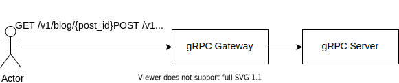
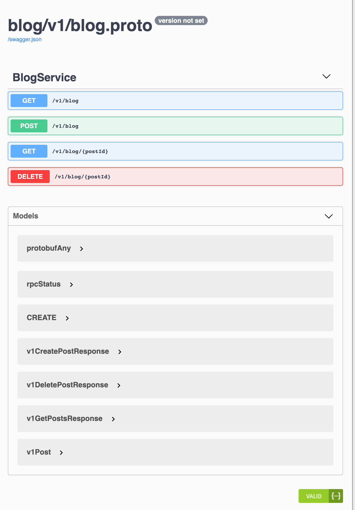

gRPC를 통해 REST 서버를 만들어 보자. gRPC 클라이언트로 연결할 수 있으면 좋지만, REST가 보편적이기 때문에 REST API를 구현해줘야 할 필요가 있다. 또한, Heroku에서는 HTTP/2 를 지원하지 않기 때문에 gRPC 를 사용할 수 없어, 어쩔 수 없이 HTTP/1.1 REST API를 노출해줘야 한다.

gRPC서버를 만들어놓으면

- REST 서버
- OpenAPI (Swagger)
- OpenAPI 를 통한 클라이언트 코드

가 자동으로 생기게 된다. Protocol Buffer를 사용하기에 타입에 대한 걱정도 없어진다.

## Why gRPC?

gRPC는 Protocol Buffer를 사용해 정의한다. Protocol Buffer를 사용해서 정의해두면 클라이언트와 서버 코드 모두 생성 가능해 전송되는 데이터의 형식에 대해서 걱정하지 않아도 된다.

예를 들어, 클라이언트에서는 underscore 인줄 알고 보냈는데

```json
{
  "my_name": "ABC"
}
```

서버에서는 camelCase의 형식으로 생각하고 적을 수 도 있다.

```json
{
  "myName": "ABC"
}
```

또한, API를 먼저 protobuf로 정의해두어야 하기 때문에 API first development가 가능하다.
게다가, OpenAPI 스펙 또한 생성 가능해서 Swagger UI 뿐만 아니라 클라이언트 코드 생성이 쉽게 가능하다.

## How?



[gRPC Gateway](https://github.com/grpc-ecosystem/grpc-gateway) 를 사용한다.

그림에서는 gRPC Gateway 와 gRPC Server가 나뉘어져 있지만 간단한 서버라면 하나의 서버/하나의 포트에서 실행시킬 수 도 있다.

### 비슷한 방법들

아래 두개 모두 gRPC Gateway 와 비슷한 기능을 한다. 하지만 gRPC Gateway의 장점은 하나의 서버에서 하나의 포트에서 gRPC와 REST Endpoint를 동시에 서빙 가능하다는 점이다.

- gRPC-Web
- Extensible Service Proxy (ESP)

## Code

protobuf에서 `google.api.http`를 사용해 REST API를 설정해주기만 하면 된다.

```protobuf
syntax = "proto3";
package blog.v1;

import "google/api/annotations.proto";

service BlogService {
    rpc CreatePost (CreatePostRequest) returns (CreatePostResponse) {
        option (google.api.http) = {
            post: "/v1/blog"
            body: "*"
        };
    }
    rpc GetPosts (GetPostsRequest) returns (GetPostsResponse) {
        option (google.api.http) = {
            get: "/v1/blog/{post_id}"
            additional_bindings {
                get: "/v1/blog"
            }
        };
    }
    rpc DeletePost (DeletePostRequest) returns (DeletePostResponse) {
        option (google.api.http) = {
            delete: "/v1/blog/{post_id}"
        };
    }
}
```

예를 들어, `POST /v1/blog`를 보내면 `BlogService.CreatePost` RPC를 실행시킨다.

프로토 파일을 정의했으면 `protoc` 나 `buf` 를 사용해 코드를 생성해주기만 하면 된다.

Buf를 사용할 경우, `buf.gen.yaml` 를 아래와 같이 생성하고 `buf generate` 하면 된다.

```yaml
# buf.gen.yaml
version: v1beta1
plugins:
  - name: go
    out: gen/go
    opt:
      - paths=source_relative
  - name: go-grpc
    out: gen/go
    opt:
      - paths=source_relative
  - name: grpc-gateway
    out: gen/go
    opt:
      - paths=source_relative
```

하나의 바이너리에서 gRPC Gateway 와 gRPC Server를 동시에 서빙하는 Go 서버 파일은 다음과 같다.

```go
package main

var port = flag.Int("port", 80, "--port 80")

type blogImpl struct {
  posts []*v1.Post
  v1.UnimplementedBlogServiceServer
}

// 헤더를 보고 Content-Type: application/grpc 라면 gRPC 서버 핸들러를 이용하고
// 그 이외에 경우는 REST API이기 때문에 Gateway 핸들러에게 보내준다.
func allHandler(grpcServer *grpc.Server, httpHandler http.Handler) http.Handler {
  return h2c.NewHandler(http.HandlerFunc(func(w http.ResponseWriter, r *http.Request) {
    if r.ProtoMajor == 2 && strings.Contains(r.Header.Get("Content-Type"), "application/grpc") {
      grpcServer.ServeHTTP(w, r)
    } else {
      httpHandler.ServeHTTP(w, r)
    }
  }), &http2.Server{})
}

func main() {
  flag.Parse()

  addr := fmt.Sprintf(":%d", *port)

  // gRPC 서버 생성
  grpcServer := grpc.NewServer()
  v1.RegisterBlogServiceServer(grpcServer, &blogImpl{})

  // gRPC Gateway 생성
  gwmux := runtime.NewServeMux()
  err := v1.RegisterBlogServiceHandlerFromEndpoint(context.Background(), gwmux, addr, []grpc.DialOption{grpc.WithInsecure()})
  if err != nil {
    panic(err)
  }

  err = http.ListenAndServe(addr, allHandler(grpcServer, gwmux))
  if err != nil {
    panic(err)
  }
}
```

그러면 완성이다. 서버를 실행한 후 REST API가 제대로 작동하는지 `curl` 을 사용해 확인할 수 있다.

`POST /v1/blog` 를 통해 새로운 블로그 포스트 생성.

```shell
$ curl -X 'POST' \
  'https://grpc-gateway-example.herokuapp.com/v1/blog' \
  -H 'accept: application/json' \
  -H 'Content-Type: application/json' \
  -d '{
  "content": "내용 내용 내용"
}'

{
  "post": {
    "id": "1619938066293158896",
    "content": "내용 내용 내용",
    "createdAt": "2021-05-02T06:47:46.293159328Z"
  }
}
```

`GET /v1/blog` 를 통해 작성된 블로그 포스트 가져오기.

```shell
$ curl -X 'GET' \
  'https://grpc-gateway-example.herokuapp.com/v1/blog' \
  -H 'accept: application/json'

{
  "posts": [
    {
      "id": "1619938066293158896",
      "content": "내용 내용 내용",
      "createdAt": "2021-05-02T06:47:46.293159328Z"
    }
  ]
}
```

정리하면, gRPC 를 사용할 경우

- 완전한 API First Development가 가능하다.
  - 일반적인 경우 swagger.json 파일을 손으로 작성하기 매우 까다롭기 때문에 API First Development가 매우 어렵다.
- 인터페이스가 프로토콜버퍼에 정의되어 있어 클라이언트와 서버와 서로 잘못된 데이터를 사용하는 일이 없다.
- 코드가 자동으로 생성되어 boilerplate 코드를 훨씬 줄일 수 있다.

실제 이 코드는



- https://grpc-gateway-example.herokuapp.com/swagger-ui 에서 테스트 가능하다.

더 자세한 코드는 https://github.com/kkweon/grpc-rest-via-gateway 에서 볼 수 있다.
