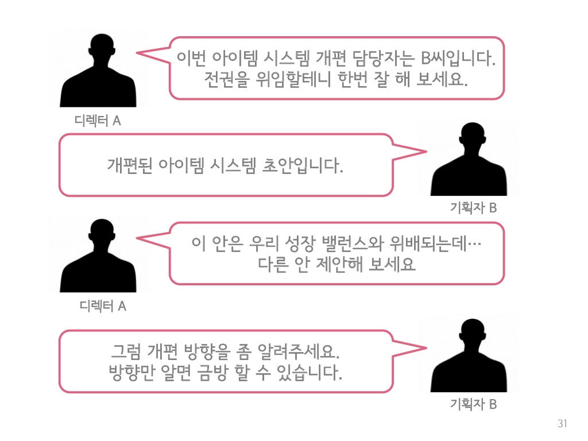
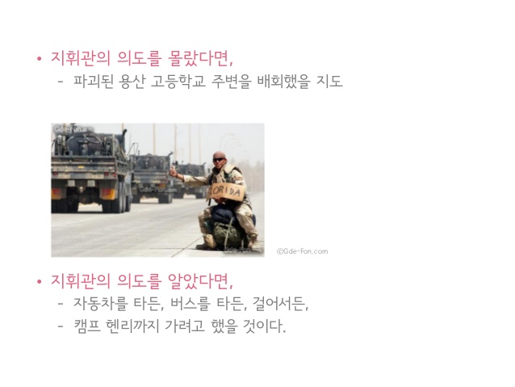
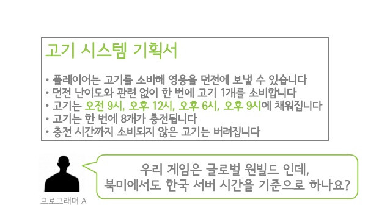
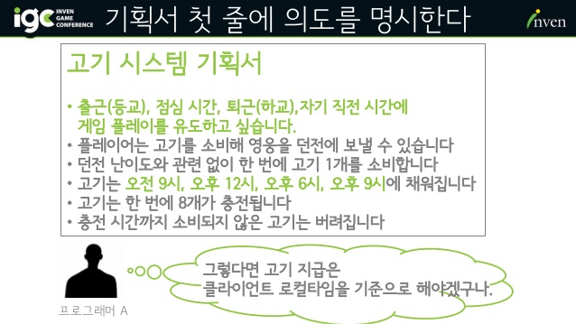
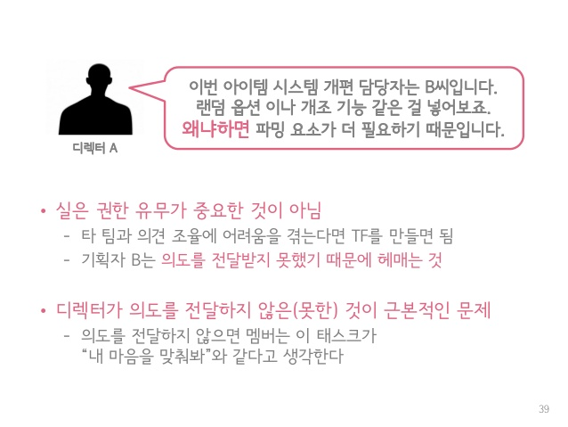
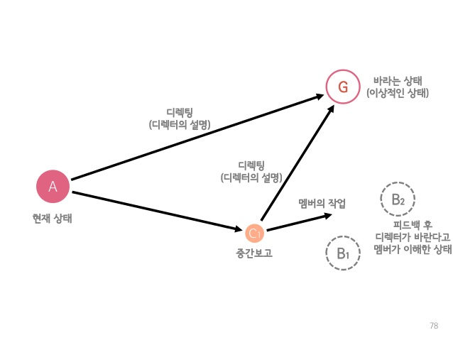
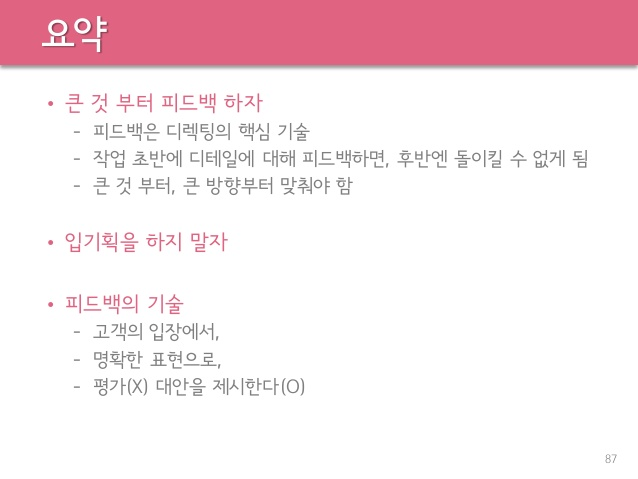

[game_directing_tutorial]: https://www.slideshare.net/iyooha/ss-69350767/31

한국에서 여러 회사에 다닌 곳 중에서 가장 기억에 남는 곳은 블루홀(현재는 크래프톤) 입니다. 그때 운이 좋게도 이상균 디렉터님으로부터 "의도"를 전달하는 커뮤니케이션에 대해 알게 되었고 깊이 익혀 항상 커뮤니케이션을 잘한다는 소리를 주변으로부터 들어올 수 있었습니다.

보통 일반적인 회사에서의 커뮤니케이션 문제는 다음 그림과 같이 '의도'가 명확하게 드러나지 않은 소통을 하기 때문에 발생합니다.

## 전시 행동 강령

모든 부대에는 전시에 특별한 지시 없어도 일사불란하게 움직이도록 "전시 행동 강령" 이라는 게 있습니다. 예를 들어, 이상균 님은 카투사로 복무하면서 다음과 같은 전시 행동 강령을 부여받았습니다.

- 모든 문서를 파기하고 하드디스크를 뽑아 들고
- 용산 고등학교 운동장에서 헬기를 타는 것

그런데 말입니다. 용산 고등학교가 파괴되었다면? 단순 지시사항이 저게 전부였다면 용상 고등학교 근처에서 우왕좌왕했을 것입니다.

그런데 만약 "최신 카투사 신병 자료를 캠프 헨리까지 옮겨야 한다" 는 의도가 전달되었다면?

탈것을 구하든, 걸어서든 캠프 헨리까지 가려고 했을 것입니다.

## 지휘관의 의도

- 1980년 미 육군에서 대부분의 전시 행동 강령과 작전계획이 무용지물이 된다는 걸 깨닫고 대안으로 제시한 개념
- 모든 명령서에는 최상단에 의도를 짧게 서술
- 강령보다 의도를 중심
- 하드디스크를 들고 용산 고등학교로 가라 (X)
- 최신 카투사 신병 자료를 캠프 헨리의 작전 본부까지 옮겨라 (O)

## 지시를 전달할 때는 "왜냐하면" 이 들어간다.

  

    
  

  

    
  

고기는 오전 9시, 자정, 오후 6시, 오후 9시에 채워집니다. **왜냐하면** 출근(등교), 점심, 퇴근(하교) 자기 직전 시간에 게임 플레이를 유도하고 싶습니다.

> 의도를 전달하지 않으면 "내 마음을 맞춰봐"와 같다.

맨 위에 나온 슬픈 대화 내용도 디렉터가 의도를 전달했다면 다음과 같을 것입니다.

## 디렉팅이 아니더라도 의도 전달은 중요하다.

이 글을 쓴 목적이 이것입니다. 디렉팅이 아니어도 의도 전달은 중요합니다.

실제로 겪은 한가지 예는 다음과 같은 상황입니다.

> "CLI 애플리케이션을 위해 A 라이브러리 사용법을 문의하고 싶은데요 **왜냐하면** 코드를 제출할 때마다 주요 체크리스트를 점검할 수 있도록 유저가 로컬에서 돌려볼 수 있게 하고 싶습니다."

그러면 종종 저는 "그런 경우라면 CLI보다 린터 서버를 구성해 자동으로 실행되도록 하는 것이 어떨까요?"라는 답변을 들을 수 있습니다. 의도를 전달하지 않았다면 저는 A 라이브러리 사용법에 대해 듣고 그것이 최선인 방법인 것으로 알고 계속 진행했을 것입니다.

코드 리뷰를 하더라도 항상 의도를 적어주면 오해가 적어지게 됩니다.

> "여기서는 하드코딩으로 변경해주세요 **왜냐하면** Example 코드로 문서화되기 때문에 유저가 변수를 찾기 위해 점프하는 일이 없도록 하고 싶습니다."

위는 예시를 든 것이고 회의에서 의견을 제시하더라도 **왜냐하면**을 붙여준다면 오해가 적어지고 또 다른 좋은 의견을 끌어내게 됩니다.

## 결론

업무에서 의사소통하면서 "왜냐하면"을 사용하고 있는지 되돌아보시길 바랍니다. 이 외에도 이상균님으로부터 배운 지식들로는 DRI(Directly Responsible Individual) 등 및 좋은 결정을 하는 방법 등이 있습니다.

그리고 위에 적은대로 의도 전달만으로는 충분하지 않을 수 있습니다.

디렉터와 멤버간의 이해차이가 발생하였고 디렉터는 의도 전달을 통해 디렉팅을 하지만 여전히 제대로 된 의도 전달이 안되었을 수 도 있습니다.

그래서 중요한 것이 피드백을 잘하는 방법입니다.

더 궁금하신 분들은 꼭 이상균 님의 [게임 디렉팅 튜토리얼][game_directing_tutorial]을 살펴보시기를 추천드립니다.

이외에도 더 좋은 내용 디스커션을 원하시는 분들은 [딥백수 슬랙](https://bit.ly/2Sqdnws)을 방문해주세요.

## 레퍼런스

- 이상균 - 게임 디렉팅 튜토리얼: https://www.slideshare.net/iyooha/ss-69350767/31
- 이상균 - 프로그래머에게 사랑받는 게임 기획서 작성법: https://www.slideshare.net/iyooha/20101002-53482961
