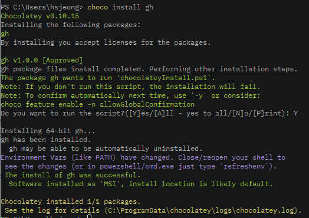
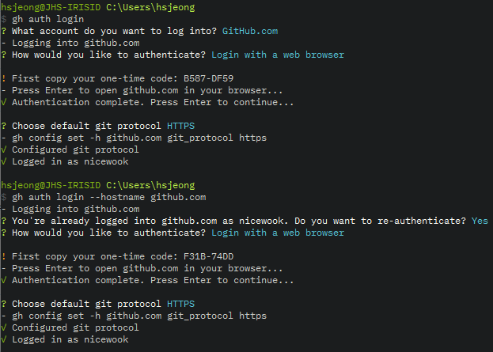
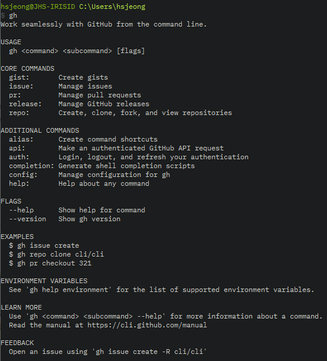
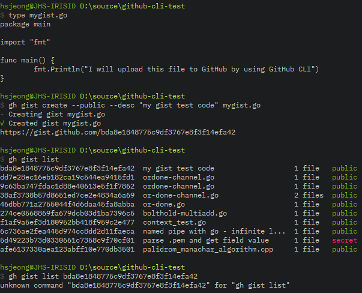
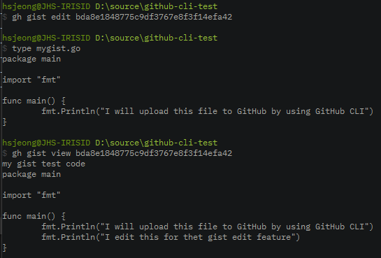
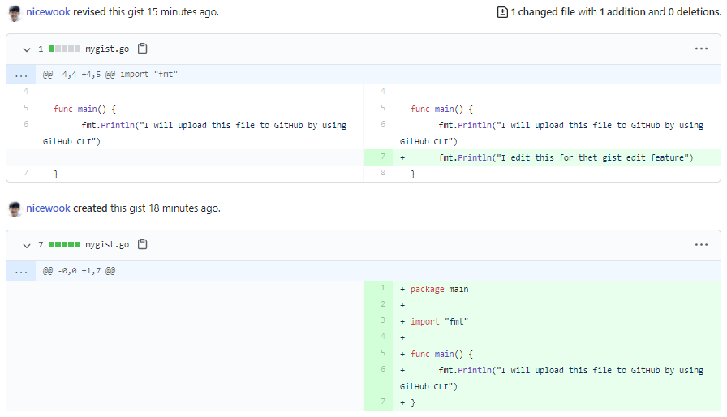

GitHub CLI 가 나왔다 한다.
GitHub 을 이용해 본격적인 협업을 하지는 않지만 백업 용도로 잘 쓰고 있기에 이런 저런 기능이 있구나 하고 넘어가기 보다는 나의 용도에 적합한 기능들 만이라도 직접 한번 써보고자 한다.

GitHub Repo: https://github.com/cli/cli
Official Document: https://cli.github.com/manual/

## 설치

Chocolatey 가 설치되어 있었기에 Powershell 을 관리자 모드로 열어서 아래와 같이 gh 를 설치 완료

## 로그인

\$ gh auth login 또는 \$ gh auth login --hostname github.com 으로 로그인을 해주면 준비 완료이다.

## 손이 가는 명령들 사용해보기

설치하고 보니 아래와 같은 명령들이 가능하다.
해보고 싶은 것은

**gist 생성하기**

- 언제든 동작하는, 나중에 참고하고픈 코드들을 gist 로 백업해둘 수 있다.

**repo create, clone, view**

- GitHub 로 가지 않고도 바로 repo 를 생성할 수 있다.
- clone 은 git clone 과 뭐가 다른지 궁금하다
- view 기능은 정확히 어떤 기능일지 궁금하다

당장은 쓰지 않더라도 기대 되거나 궁금한 기능

- **alias**: git 도 alias 를 잘 쓰고 있기에 이것도 궁금하다
- **completion**: 이건 상상이 안가는데 script 관련이라니 사용처가 궁금하다
- **pr**: gh 기능의 꽃이 pr 이 아닌가 싶다. 특히 예시로 나오는 pr checkout 을 하면, pr 을 바로 내려받아서 빌드하고 돌려볼 수 있겠다.

## create gist / list gist

이번 포스팅에서는 gist 까지만 사용해보자.
만들어둔 코드가 마음에 들어 gist 에 넣어두고 싶다면 아래와 같이 해주면 된다.

1. default 가 secret 이므로 public 으로 올리려면 _--public_ 옵션을 준다.
2. 별도로 설명을 추가하고 싶다면 _--desc_ 옵션을 이용한다. 이걸 쓰지 않으면 파일명이 들어간다.

3. 개인적으로 gist 의 활용은 때때로 써야할 기능들을 cloud 에 저장해놓고 필요할때 다시 가져와서 보는데 있다.
4. 예를 들어 Go 언어로 AES256 암호화/복호화를 하는 코드 같은 것
5. 아래와 같이 간단히 _\$ gh gist list_ 명령으로 내가 Cloud 에 올려놓은 gist 의 리스트를 볼 수 있다.
   - gist 가 많아진다면 query 나 간단한 regexp 로 추려낼 수 있으면 좋겠다.

## edit gist / view gist

이 기능을 써보면서 박수를 쳤다.

1. list 명령으로 원하는 gist 를 찾아냈다면 해시값 (gist ID) 로 edit 하겠다는 요청을 할 수 있다.
   - git 에서처럼 hash 의 앞쪽 일부만으로 요청은 불가하였다.
2. _\$ gh gist edit_ 명령만으로 지정해놓은 editor 로 바로 코드가 열린다.
3. 그리고 수정이 끝나 editor 를 닫으면 바로 Cloud 에 수정된 내용이 올라간다.

_\$gh gist view_ 명령을 통해 gist 에 올린 원본인 mygist.go 파일은 전혀 건드리지 않고, gist 의 내용만 변경된 것을 확인할 수 있다.

GitHub 로 가서 보면 변경된 히스토리가 모두 저장되어 있음을 알 수 있다.

## 이어서

이어지는 posting 에 pr 과 repo 관련한 기능을 써보겠다.

덧붙여 한마디 해보고 싶다. **Learning by doing** 이라는 말이 있다.
GitHub CLI 가 정식 릴리즈 되었다는 말을 들었고 이런 저런 기능이 있다는 말 정도만 듣고 언젠가 써볼까 생각만 했었는데
짬을 내어 이렇게 들여다보고 손으로 직접 타이핑을 해보니 그냥 눈으로 흝어본 것과는 하늘과 땅의 차이가 난다.
무엇이든 손으로 직접 해보자.
