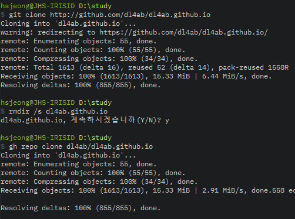
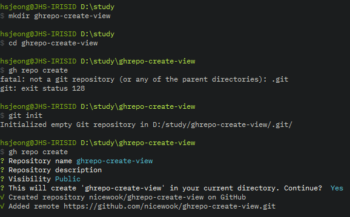
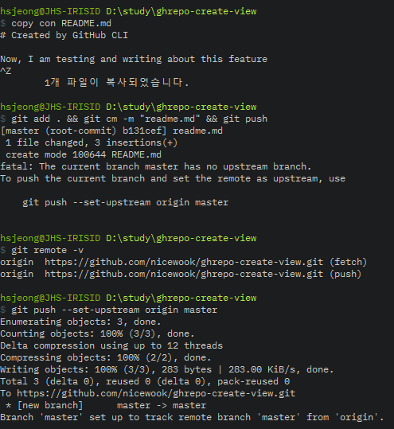
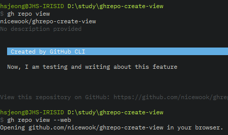
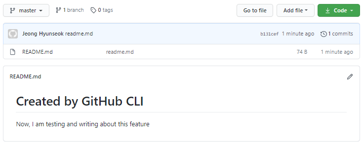

<figure style="display: flex; flex-direction: column; align-items: center">
  
  <figcaption>Photo by <a href="https://unsplash.com/@yancymin?utm_source=unsplash&amp;utm_medium=referral&amp;utm_content=creditCopyText">Yancy Min</a> on <a href="https://unsplash.com/s/photos/github?utm_source=unsplash&amp;utm_medium=referral&amp;utm_content=creditCopyText">Unsplash</a></figcaption>
</figure>

gist 를 만져보며 GitHub CLI 에 대한 기대감이 커졌다. 이번에는 repo 와 관련한 기능을 써보고자 한다.
이렇게 신기해하며 사용법을 익히는 것보다 더욱 중요한 것은 실제로 꾸준히 쓰는 것이겠다.
좋은 분들과 함께하는 딥백수 커뮤니티에 블로그 포스팅을 자주하며 기능들을 내 것으로 만들어야 겠다.

- GitHub Repo: https://github.com/cli/cli
- Official Document: https://cli.github.com/manual/

## Clone repo

두 명령은 같다. 장단점이나 차이를 모르겠다.

    $ gh repo clone deepbaksu/deepbaksu.github.io
    $ git clone http://github.com/deepbaksu/deepbaksu.github.io

## Create repo

이거 정말 유용하다. 실전에는 보통 아래와 같이 했었다.

1. 프로젝트 폴더를 만들고 기본적인 구현을 한 다음에
2. GitHub 사이트로 가서 repo 를 생성하고 다시 local 의 repo 와 연결해주는 작업을 한다.

GitHub CLI 를 이용하여 repo 를 생성하는 여러 옵션이 있지만 이렇게 쓰게 될 것 같다.

1. 프로젝트 디렉토리를 만들고, 그 디렉토리로 들어간 다음
2. `$ gh repo create` 만 먹여주면 디렉토리 이름으로 repo 가 만들어진다.

### 실습

1. 디렉토리를 생성하고 들어가서 바로 repo 를 생성하려 하였지만 실패!

- git 디렉토리 이어야 한다.

2. `$ git init` 을 해주고 `$ gh repo create` 를 해주니 성공

- interactive 하게 repo 이름, description, public 여부를 설정해주면 된다.

## View repo

repository 를 본다는 것이 무얼 말하는 것인지 처음에는 이해가 가지 않았다.
여러 옵션이 있지만 현재 CLI 화면의 git 의 GitHub repo 를 브라우저에서 열때 가장 많이 사용할 듯 하다.

    $ gh repo view // 만 쳐주면 README.md 만 보여주지만
    $ gh repo view --web // 을 쳐주면 브라우저에서 GitHub repo 를 바로 열어준다.

### 실습

1. README.md 파일을 만들어준 다음,
2. git add, commit, push 를 해주었다.

- 여기서 신기했던게 --set-upstream 이 자동으로 되어 있을것만 같았는데 해줘야 한다는 것

3. `$ gh repo view` 를 해주면 해당 repo 의 README.md 를 보여준다
4. `$ gh repo view --web` 옵션을 추가해주면 바로 해당 repo 의 GitHub 페이지를 브라우저에서 열어준다.

5. 아래와 같이 Browser 에서 열린다. 편리하다!

## Alias

평소에 git 도 alias 를 잘 쓰고 있다.

    $ git cb // git checkout --branch
    $ git cm -m // git commit -m

위 GitHub CLI 명령중 create 와 view 는 단축키를 지정해주면 편할 것 같다.
아래와 같이 설정 해보자

    $ gh repo create →  $ gh rc
    $ gh repo view →   $ gh rv
    $ gh repo view --web →  $ gh rvw

Official document (https://cli.github.com/manual/) 자체가 길지 않아 30분-1시간을 흝어보면 왠만한 기능은 이해가 되고, 여기처럼 실습까지 해주면 대부분의 feature 는 충분히 소화해 낼 수 있을것 같다. 마지막으로 pull request 를 잘 다뤄보고 싶은데 이건 좀더 실전 경험이 쌓이면 정리해보려 한다.

GitHub CLI 에서

1. PR 을 보내거가, PR 을 리뷰하고
2. 제안된 수정사항을 검토하거나 빌드해보고
3. merge 까지 해보는 거다.
