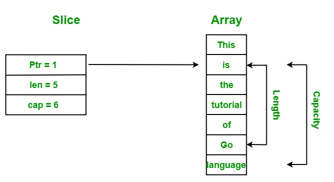
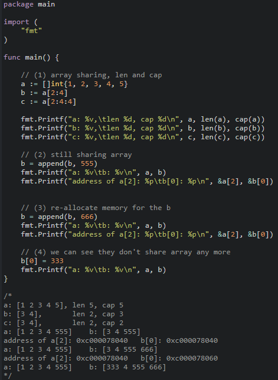
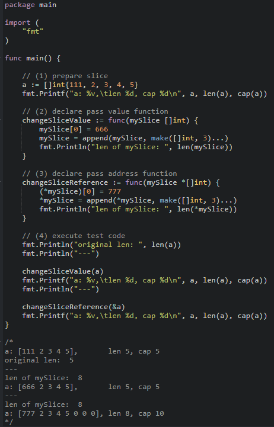

Go의 슬라이스는 배열과 비슷한 듯 다르다. 슬라이스는 세 개의 필드를 가진 데이터 구조이다.

1. 포인터: 실제 값이 들어있는 배열의 주소를 가리킨다
2. Length: 값이 들어있는 길이를 가리킨다.
3. Capacity: 실제 값은 들어있지 않지만 미리 확보해놓은 메모리 공간이라 생각하면 된다.

`Capacity` 이내 에서는 `append`를 하더라도 다른 곳으로 메모리를 재할당 할 필요가 없다. 저장하는 메모리 공간을 이사할 필요가 없다는 것이다.

적절할지 모르겠지만 비유를 해본다. 아파트의 방에 한 명씩 살아야 한다고 하자. 방 4개 짜리 아파트에 (cap==4) 세 명이 각각 방 하나씩을 차지하고 있는 경우 (len==3) 한명이 더 들어와 살더라도 방 5, 6개 짜리 아파트로 이사할 필요가 없는 것이다. 하지만 여기서 한 명이라도 더 들어오면 방이 더 많은, 다른 아파트로 이사를 해야 한다.

이론적인 부분은 이만 줄이고 실제 코드로 부딪혀가며 이해해보자.

## 실습

실습을 통해 다음과 같은 상황을 확인해보자
같은 배열을 가리키는 두 슬라이드가 있다고 할 때에

1. 같은 메모리 주소의 하나의 값을 변경하면 나머지 하나도 바뀔 것이다. 슬라이스의 포인터가 같은 배열을 가리키고 있기 때문이다.
2. 그러면 두 슬라이스 중에 하나가 다른 하나의 일부일 때에, 그 슬라이스를 append 한다면?
   - cap 이내일때는 여전히 같은 배열을 가리키겠지만
   - cap 을 넘어서는 append 의 경우에는 두 슬라이스는 다른 배열을 가리키게 될 것이다.
3. 슬라이스를 함수에 값으로 전달한다면 어떻게 될까?
   - 슬라이스가 복제된다. 포인터는 같은 배열을 가리킨다.
   - 하지만 함수 내에서 슬라이스의 len, cap 을 변경해도 원래 슬라이스의 len, cap은 변하지 않을 것이다.
     → 같은 배열을 가리키는 두 개의 별개의 슬라이스인 것이다.
4. 슬라이스를 함수에 포인터로 전달한다면 어떻게 될까?
   - 포인터, len, cap 이 온전히 전달되고,
   - 함수내에서 이들이 바뀌면 원본 역시 변할 것이다.

### 배열 함께 쓰기, 이별하기

Play ground: https://play.golang.org/p/RxLFuykp9XH

(1) a, b, c 슬라이스는 모두 같은 배열을 가리키고 있다.

- b는 len은 2이지만, cap은 a의 cap 나머지와 같은 3이다.
- c와 같이 cap도 정확히 설정할 수 있다.

(2) b 슬라이스를 append 해도 아직 여분의 cap 공간이 있다

- 그래서 b 슬라이스가 메모리 이사를 갈 필요가 없다.
- 그래서 a[5]와 b[3]의 값이 함께 바뀐다.
- 포인터가 가리키는 배열의 같은 위치 원소의 주소값도 같다.

(3) b 슬라이스를 한 번더 append 해보자

- 이제는 b 슬라이스가 이사를 가야한다.
- 포인터가 가리키는 배열의 같은 위치였을 원소의 주소값이 다르다.
- (4)를 보면 이제 완전히 별개의 두 배열을 가리키고 있는 것을 알 수 있다.

### 함수에 슬라이스 전달하기

Play ground: https://play.golang.org/p/5qg7NVNH2Ic

(1) len 5, cap 5 인 a 슬라이스를 만들었다.

(2) (3) 은 각각 슬라이스와 슬라이스 주소값을 전달받는 함수를 선언하였다.

- 슬라이스의 첫번째 원소의 값을 바꾸고
- 슬라이스에 빈 원소 3개를 append 한 다음
- 함수 안에서 슬라이스의 변경된 길이를 출력해 보았다.

(4) 함수를 실행해보니

- a 슬라이스는 len 5, cap 5로 생성이 되어있고
- changeSliceValue 함수의 경우는 - a 슬라이스의

  - 첫번째 원소의 값은 바꾸었지만
  - len, cap 은 바꾸지 못하였다.

- changeSliceReference 함수의 경우는 a 슬라이스의
  - 첫번째 원소의 값을 바꾸었고
  - len, cap 까지도 바꾸었다.

