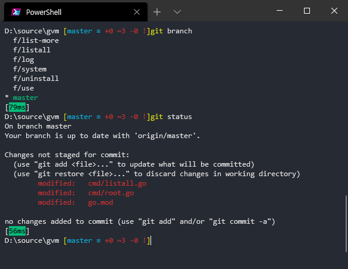
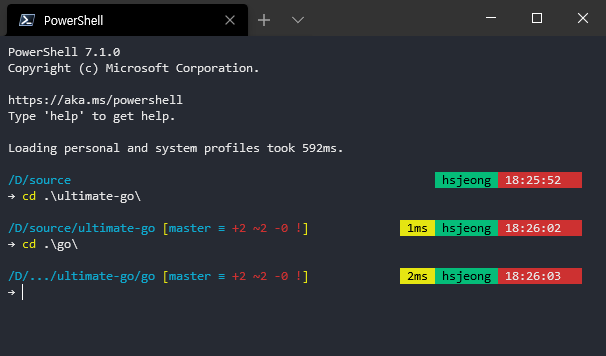

지난번에는 git 자동 완성기능을 사용하고, prompt에 git 정보를 추가하고 싶어서
재빨리 구글링하여 PowerShell 에서 원하는 기능을 만들었다.

참고링크: https://jusths.tistory.com/180

아래는 그 결과물이다.

1. git 자동완성이 되며
2. git 정보가 prompt 에 나오며
3. 마지막 명령의 실행 소요시간이 표시된다.



이번에는 이를 위해 사용한 스크립트를 조금 더 분석하여 나만의 prompt 를 만들어 보았다.

1. 디렉토리를 Linux 스타일로 표현하고, 이어서 `posh-git`의 git 정보가 표시된다.
   - 디렉토리가 너무 길면 … 으로 줄여서 표현한다.
2. 명령의 실행 소요시간을 우측 정렬로 노란색 배경컬러로 표시했다.
3. 이어서 User 정보, 현재 시간을 표시하였다. User 정보는 Administrator 이면 Admin 으로 표시된다.
4. 프롬프트는 다음줄에 작고 앙증맞은 → 화살표로 하였다.



최종 결과는 GitHub Gist 에 올려두었다.
GitHub Gist: https://gist.github.com/83ea6615ff5a8c2baf5682443f39dc42

## 스크립트 간단 분석

본인의 PowerShell prompt 에 적용하려면 user 디렉토리의 Documents\PowerShell 로 들어가서 profile.ps1 파일에 Gist의 스크립트를 덮어쓰면 된다.

1. PowerShell이 실행될 때마다 `function Prompt()` 를 가져와서 PowerShell 의 prompt 를 그릴때에 사용한다.
2. `Write-Host` 는 echo 와 같다고 보면 된다. 화면에 출력을 해주는 기능이다.
   - 명령들 사이에 한 줄을 띄워주려 사용하였다. 줄 바꿈을 하지 않으려면 `-NoNewLine` 옵션을 주면 된다.
3. PowerShell 의 배열을 다루는 함수들을 사용하여 현재 디렉토리 경로 문자열을 다듬었다.
   - Linux 처럼 보이게 콜론(:)을 없애고, 역슬래시(\)를 기준으로 문자열을 나누어 배열에 담은 다음
   - 배열의 개수가 3개 이상인지 여부로 분기하여, 너무 긴 경로는 `…` 로 줄여줄 수 있도록 하였다.
   - 그리고 `-join` 을 사용하여 슬래시(/)로 Linux 느낌이 나게 다시 경로 문자열을 만들었다.
4. 만든 문자열을 `Write-Host` 로 출력하여 첫번째 출력을 완성하였다.
   - 이때 `-ForegroundColor Cyan` 옵션을 이용하여 글자색을 바꾸어 보았으며
   - 같은 라인에 추가적인 정보를 담으려 하기에 `-NoNewLine` 으로 줄바꿈을 방지했다.

```powershell
function Prompt {
    Write-Host # one blank line
    # 1. pwd
    $pwdArray = $($pwd.path -replace ':', '').split('\')
    if ($pwdArray.count -gt 3) {
        $linuxPath = "/$($pwdArray[0], '...', $pwdArray[-2], $pwdArray[-1] -join ('/'))"
    } else {
        $linuxPath = "/$($pwdArray -join ('/'))"
    }
    write-host $linuxPath -ForegroundColor Cyan -NoNewline
```

1. vcsStatus 출력은 Posh-git 이 import 되었는지를 확인하여, Write-VcsStatus 를 이용하여 출력을 하였다.
2. 이 출력부분 역시 costomize 가능한 것으로 알고 있는데 심심할 때 한 번 들여다보고 싶은 부분이다.

```powershell
    # 2. git status
    if (Get-Module Posh-git) {
        $vcsStatus = Write-VcsStatus
        write-host $vcsStatus -NoNewline
    }
```

### 오른쪽 정렬하여 출력할 세 가지 정보

마지막 실행한 명령의 실행 소요시간, Administrator 인지를 포함한 User 정보, 현재 시간을 오른쪽 정렬로 뿌려보려고 한다.
이를 위해서 각각의 정보를 우선 문자열로 뽑아 보았다.

`$elapsedTime` 은 마지막 명령의 실행 소요시간을 담고 있다.
참고 코드는 소요시간의 범위에 따라 다른 색깔, 다른 포맷으로 출력이 되도록 분기한 것이었는데,
그 결과를 바로 출력하지 않고 문자열에 담도록 하고, 색깔과 관련한 부분은 제외하였다.
조금 복잡해 보이지만 차근히 따라가면 이해가 될 것이다.

```powershell
    # 3. get command execution time
    $history = Get-History -ErrorAction Ignore -Count 1
    if ($history) {
        $elapsedTime = " "
        $ts = New-TimeSpan $history.StartExecutionTime $history.EndExecutionTime
        switch ($ts) {
            { $_.TotalSeconds -lt 1 } {
                [int]$d = $_.TotalMilliseconds
                $elapsedTime += '{0}ms' -f ($d)
                break
            }
            { $_.totalminutes -lt 1 } {
                [int]$d = $_.TotalSeconds
                $elapsedTime += '{0}s' -f ($d)
                break
            }
            { $_.totalminutes -ge 1 } {
                $elapsedTime += "{0:HH:mm:ss}" -f ([datetime]$ts.Ticks)
                break
            }
            Default {
                $elapsedTime += '{0}ms' -f ($d)
            }
        }
        $elapsedTime += " "
    }
```

`$adminHeader` 는 PowerShell 이 Administrator 로 실행되고 있는지 확인하여, Admin 또는 USERNAME 으로 문자열을 저장해둔다.

```powershell
    # 4. check if admin
    $currentUser = [Security.Principal.WindowsPrincipal](
        [Security.Principal.WindowsIdentity]::GetCurrent())
    $isAdminProcess = $currentUser.IsInRole(
        [Security.Principal.WindowsBuiltInRole]::Administrator)
    $adminHeader = if ($isAdminProcess) { ' Admin ' } else { " $env:USERNAME " }
```

현재 시간을 `$now` 변수에 담는다.

```powershell
    # 5. time
    $now = get-date -format " HH:mm:ss "
```

만들어둔 세 문자열 `$elapsedTime`, `$adminHeader`, `$now` 을 오른쪽 정렬로 출력한다.

```powershell
    # 6. align right: elapsedTime, adminHeader, now
    $rightInfo = "$elapsedTime$adminHeader$now  "
    $startposx = $Host.UI.RawUI.windowsize.width - $rightInfo.length
    $startposy = $Host.UI.RawUI.CursorPosition.Y
    $Host.UI.RawUI.CursorPosition = New-Object System.Management.Automation.Host.Coordinates $startposx,$startposy

    if ($elapsedTime.length -ne 0) {
        write-host $elapsedTime -ForegroundColor Black -NoNewline -BackgroundColor DarkYellow
    }
    write-host $adminHeader -ForegroundColor Black -NoNewline -BackgroundColor DarkGreen
    write-host $now -ForegroundColor Gray -NoNewline  -BackgroundColor Red
```

화살표를 출력한다. 왜 마지막 줄은 Write-Host 를 사용하지 않아도 출력이 되는 것인지는 모르겠다.
이렇게 하면 `PS>` 라는 prompt 도 사라진다. 이것 역시 정확한 이유는 알지 못한다.

```powershell
    # 8. prompt arrow
    if ($host.UI.RawUI.CursorPosition.X -gt 0) { Write-Host }
    "$([char]0x2192) "
```

마지막으로 posh-git 을 import 해주면 된다.

`Import-Module posh-git` 은 말 그대로 posh-git 을 가져와서 git 과 관련한 정보를 쓸 수 있게 해준다.

끝
