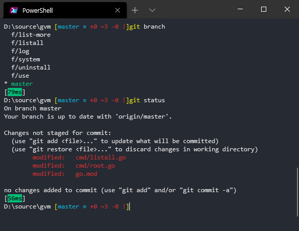

`Linux` 또는 `macOS` 환경에서는 `git` 명령들이 자동으로 완성되어 편리한데 윈도우 `cmd`나 `PowerShell`에서는 기본적으로 되지않아 불편하였다.
그렇다고 `git bash`를 사용하자니 윈도우에서는 다른 불편한 상황이 종종 발생하여

1. git 명령어를 tab으로 자동완성 할 수 있고
2. prompt에 git 정보를 담을 수 있는 방법을 찾아 보았다.

## TL;DR - 너무 길면 읽지 않을꺼죠?

1. PowerShell 은 당연히 설치되어 있어야 한다. 현시점에서는 버전 `7.1.0-rc.2`를 설치하였다.
2. posh-git 을 설치한다.
3. PowerShell profile 파일을 수정하여 custom prompt를 설정한다.

그러면 git 을 사용하는 디렉토리 내에서 아래와 같이 prompt 가 나온다.

- 시간은 명령 수행 시간
- 현재 브랜치와 Working directory 상태 (현재는 modified 된 파일이 3개라는 뜻이다.



## posh-git 설치하기

GitHub: https://github.com/dahlbyk/posh-git

`posh-git` 은 PowerShell 모듈이며 Git 사용에 도움이 되는 여러 기능을 제공한다.
GitHub README.md 에 다양한 설치 방법이 나오니 참고하여 설치한다.
PowerShell에서 설치를 한다면 Administrator 로 PowerShell을 실행하고 설치해본다.

## Custom prompt 설정하기

참고 링크: https://github.com/dahlbyk/posh-git/wiki/Customizing-Your-PowerShell-Prompt

`posh-git` 이 하는 것은 결국 PowerShell이 실행되기 전에 미리 prompt에 대한 설정을 해두는 것이다.
**그래서 어느 파일을 건드려야 하는건가?** 이걸 알아내기가 힘들어서 헤매었고, 이 포스팅을 하게 되었다.

`profile.ps1` 을 수정해야 한다. 이 파일은 사용자 디렉토리의 `Documents\PowerShell` 폴더에 있다.
처음 `posh-git` 을 설치하면 단 한 줄 밖에 없을 것이다.

```
Import-Module posh-git
```

즉, posh-git을 가져온 다음에 PowerShell 을 실행하겠다는 것이다.
이렇게 가져오기 전에 function Prompt 를 정의해주면 된다.

구글링하여 아래 링크를 참고하여 설정해보았다.

링크: https://melcher.dev/2019/03/powershell-prompt-awesomeness-you-need-this/

항목 하나하나에 대한 자세한 분석은 하지 않았다. 조금 더 커스터마이즈 하고 싶으면 조금씩 수정해가면서 확인하면 될 것이다.

```
function Prompt {

    try {
        $history = Get-History -ErrorAction Ignore -Count 1
        if ($history) {
            Write-Host "[" -NoNewline
            $ts = New-TimeSpan $history.StartExecutionTime $history.EndExecutionTime
            switch ($ts) {
                {$_.TotalSeconds -lt 1} {
                    [int]$d = $_.TotalMilliseconds
                    '{0}ms' -f ($d) | Write-Host -ForegroundColor Black -NoNewline -BackgroundColor DarkGreen
                    break
                }
                {$_.totalminutes -lt 1} {
                    [int]$d = $_.TotalSeconds
                    '{0}s' -f ($d) | Write-Host -ForegroundColor Black -NoNewline -BackgroundColor DarkYellow
                    break
                }
                {$_.totalminutes -ge 1} {
                    "{0:HH:mm:ss}" -f ([datetime]$ts.Ticks) | Write-Host -ForegroundColor Gray -NoNewline  -BackgroundColor Red
                    break
                }
            }
            Write-Host "] " -NoNewline
        }
        if(Get-Module Posh-git) {
            Write-VcsStatus
            Write-Host " " -NoNewline
        }
    }
    catch { }
    # New line
    Write-Host ""

    # show the drive and then last 2 directories of current path
    if (($pwd.Path.Split('\').count -gt 3)){
        write-host "$($pwd.path.split('\')[0], '...', $pwd.path.split('\')[-2], $pwd.path.split('\')[-1] -join ('\'))" -NoNewline
    }
    else{
        Write-Host "$($pwd.path)" -NoNewline
    }
    "> "
}

Import-Module posh-git
```

## 참 잘했어요

이렇게 설정을 하고 `VS Code` 에서 default shell 을 PowerShell로 바꾸어 주었다.

그리고, `Windows Terminal` 역시 `defaultProfile`(실행시 처음 열리는 shell)을 PowerShell 로 바꾸어 주었다.

- 끝 -
