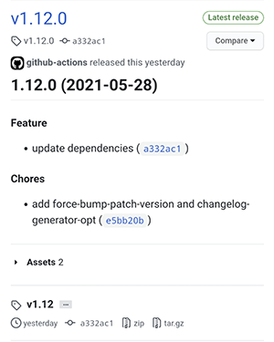

시맨틱 버전(semantic version)이라는 단어를 들어 보았을 것이다. 개념은 어렵지 않지만 막상 시맨틱 버전에 맞추어 릴리즈 하기란 쉽지 않다. 왜냐하면 그동안 커밋 목록들을 살펴보고 호환성을 깨트리는 커밋이 있었는지 확인하고 버전을 결정해야 되기 때문이다. 그래서, 이 글에서는 [시맨틱 릴리즈(semantic release)](https://semantic-release.gitbook.io/semantic-release/)라는 도구를 사용하여 시맨틱 버전을 자동화 하는 방법을 소개하고 있다. 시멘틱 릴리즈가 무엇인지 설명하기에 앞서 시멘틱 버전이 무엇인지 알아야 한다.

## 시멘틱 버전

시멘틱 버전이란 소프트웨어 패키지의 버전을 관리하는 프로토콜을 의미한다.

`{MAJOR}.{MINOR}.{PATCH}`

로 나누어

- 기존 버전과 호환되지 않게 API가 바뀌면 “MAJOR 버전”을 올리고,
- 기존 버전과 호환되면서 새로운 기능을 추가할 때는 “MINOR 버전”을 올리고,
- 기존 버전과 호환되면서 버그를 수정한 것이라면 “PATCH 버전”을 올린다.

정식배포 전 버전이나 빌드 메타데이터를 위한 라벨을 덧붙이는 방법도 있다.

```
0.0.1
1.0.0
1.0.1-pre
1.0.1
```

_시맨틱 릴리즈_ 란 커밋 메시지를 일관적으로 작성하여 이 _시맨틱 버전_ 을 자동화 해주는 도구이다.

## 컨벤셔널 커밋

이때 커밋 메시지를 일관적으로 작성한다는 것은 AngularJS 커밋메시지 규칙을 바탕으로한 컨벤셔널 커밋(https://www.conventionalcommits.org)을 의미한다.

컨벤션널 커밋은 사람과 기계 모두 이해할 수 있는 커밋메시지를 작성하기 위한 규칙이라고 볼 수 있다.

- 사람이 커밋 메시지를 읽고 중요한 변화를 바로 이해할 수 있고
- 일관화된 커밋 메시지 양식을 통해 CHANGELOG 등을 자동으로 생성한다.

컨벤셔널 커밋 메시지는 다음과 같은 양식을 사용하여 작성된 메시지를 뜻한다.

```
<type>[optional scope]: <description>

[optional body]

[optional footer(s)]
```

예를 들어, 아래 커밋 메시지를 살펴보자.

```
fix: correct MINOR typos in code

see the issue for details
on typos fixed.

Reviewed-by: Z
Refs #133
```

가장 첫번째 줄에 `fix:` 키워드를 통해 해당 커밋은 버그 수정임을 알 수 있다.

타입은 프로젝트마다 조금씩 다를 순 있으나 `fix`와 `feat`가 가장 중요한 단어이다.

일반적으로 [오리지널문서에서 정의된 타입](https://github.com/angular/angular/blob/22b96b9/CONTRIBUTING.md#type)을 사용한다.

- build: Changes that affect the build system or external dependencies (example scopes: gulp, broccoli, npm)
- ci: Changes to our CI configuration files and scripts (example scopes: Travis, Circle, BrowserStack, SauceLabs)
- docs: Documentation only changes
- feat: A new feature
- fix: A bug fix
- perf: A code change that improves performance
- refactor: A code change that neither fixes a bug nor adds a feature
- style: Changes that do not affect the meaning of the code (white-space, formatting, missing semi-colons, etc)
- test: Adding missing tests or correcting existing tests

이제 각 커밋을 컨벤셔널 커밋에 맞게 작성했을때, 다음과 같은 커밋 로그를 살펴보자.

### PATCH 업데이트

```
* 8fffafb fix: somethin
* c87775a refactor: something
```

위와 같은 커밋메시지는 **PATCH** 버전의 변화를 의미한다. 새로운 피쳐(`feat`)가 추가 되지 않았기 때문이다.

### MINOR 업데이트

```
* 8fffafb feat: create a new helper function
* c87775a fix: remove a condition
```

위 커밋 메시지들을 살펴보면 **MINOR** 버전의 변화를 의미한다. 새로운 피쳐의 추가를 의미하는 `feat` 키워드가 사용되었기 때문이다.

### MAJOR 업데이트

그럼 **MAJOR** 버전의 변화를 의미하는 커밋 메시지는 어떻게 생겼을까?

아래와 같이 **BREAKING CHANGE** 라는 키워드를 커밋 메시지에 추가해준다.

```
feat: allow provided config object to extend other configs

BREAKING CHANGE: `extends` key in config file is now used for extending other config files.
```

일관된 커밋 메시지를 사용함으로써 CHANGELOG 또한 자동으로 생성할 수 있게 된다. 시맨틱 릴리즈를 사용하면 앞으로 시맨틱 버전과 함께 CHANGELOG 또한 자동으로 생성된다.

## 실제 사용 방법

- 컨벤셔널 커밋 메시지를 사용한다.
- 이후 릴리즈가 필요할 때 시맨틱 릴리즈 프로그램을 실행한다.
- 혹은 깃헙 액션을 사용하여 자동화 한다.

시맨틱 릴리즈는 NodeJS 로 구현된 버전이 있고 Go로 구현된 두가지 버전이 존재한다.

- https://github.com/semantic-release/semantic-release
- https://github.com/go-semantic-release/semantic-release

이 글에서는 Go 버전의 go-semantic-release와 깃헙 액션을 사용한다. 그래봤자 한 줄만 추가하면 끝이다.

```yaml
steps:
  - uses: actions/checkout@master

  - uses: go-semantic-release/action@v1
    with:
      github-token: ${{ secrets.GITHUB_TOKEN }}
```

그러면 커밋 메시지를 읽어 와서 위 이미지 처럼 CHANGELOG와 함께 GitHub 릴리즈를 생성한다.

## 요약

- 컨벤셔널 커밋을 작성하면 semantic-release 를 사용하여 semantic versioning 규칙에 맞는 릴리즈를 자동화할 수 있다.

질문이나 다른 기술 이야기가 듣고 싶으시다면 딥백수 슬랙에서 들으실 수 있습니다.

https://join.slack.com/t/deepbaksu/shared_invite/zt-89q9mtj6-bGVo9T5UhOWY8YArK24_gQ
