## 1. Why I do this?

간단합니다. 회사 슬랙에 과제 알림을 자동화시키고 싶었기 때문입니다. 어떻게 해야 하는지 알기 위해 시중에 나온 자동화 관련 책들을 펼쳤습니다. 크롤러 만드는 방법과 crontab에 대해서 설명을 잘해주었지만 문제가 있었죠. 제가 따로 쓸 만한 서버가 없었습니다. 기본적으로 자동화는 24시간 돌아가는 서버를 통해서 진행하는 경우가 많습니다. 그렇다고 간단한 알림을 가지고 클라우드로 돌리긴 좀 손이 가질 않았습니다. 즉, 돈을 들이지 않고 자동화를 시키고 싶었습니다.

그러던 중 어떤 생각 하나가 떠올랐습니다.

지금 제가 이 글을 쓰고 있는 딥백수 블로그는 Branch를 나누고 GitHub Action을 format check이라든지 테스트를 자동화하는데, GitHub Action을 통해서 제가 가진 문제를 해결할 수 있을 거라고 생각했습니다.

다행히 GitHub Action에 익숙한 Mo Kweon님이 계시기에 페어 프로그래밍을 하면서 하나하나 가르쳐주셨습니다. 다른 분께 배운 지식이기에 당연히 나눠야 한다고 생각했고 이 글을 쓰며 혹시 비슷한 고민을 하시는 분께 매뉴얼이 되었으면 합니다.

## 2. Make a Crawler

크롤러는 만드셨다고 가정하겠습니다.

## 3. Make a Slack Channel

알림을 받을 슬랙 채널을 만들어줍니다. 테스트를 해야 하는 채널이기 때문에 다른 슬랙 멤버들이 메시지 수신을 하지 않도록 혼자만의 채널에서 테스트를 하시는 걸 권합니다. 저는 alert라는 채널을 만들었습니다.

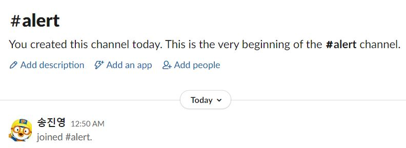

## 4. Make a Slack App

이제 슬랙 알림을 위한 설정을 들어가야 합니다. 아래 사진처럼 하늘색 동그라미를 쳐놓은 버튼을 클릭해주세요.

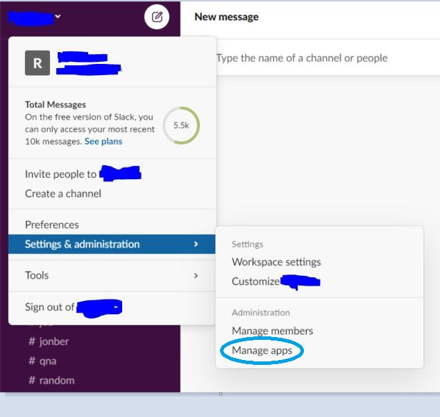

들어가 보면 다음과 같은 페이지에 접속되실 겁니다. 하늘색 동그라미를 쳐놓은 검색창에 webhook이라고 입력해준 뒤 검색해주세요.

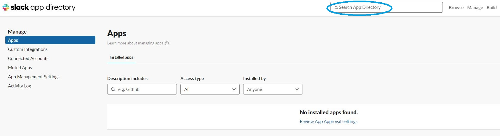

그러면 다음과 같이 결과 창이 뜰 텐데 하늘색 동그라미를 쳐놓은 Incoming Webhooks를 클릭해주세요.

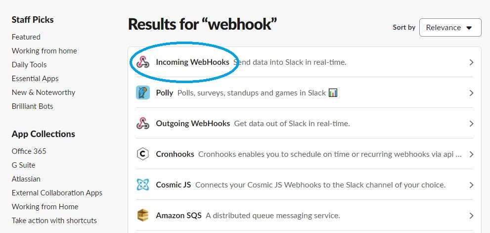

그럼 다음과 같이 Webhooks에 대한 소개를 보실 수 있습니다. JSON을 사용해서 POST 하는군요.(크롤러에서 JSON으로 데이터를 보내줘야 한다는 의미입니다) 당연히 Add 해줘야겠죠?

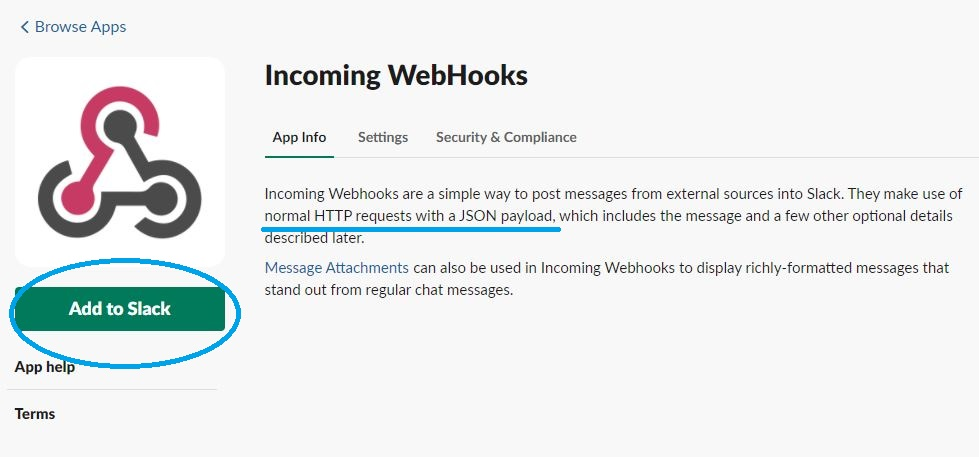

어떤 채널에 메시지를 보낼지 설정을 해줘야 합니다. 이전에 만들었던 채널을 설정해준 뒤 Add 해줍니다.

## 5. Configure Webhooks


그러면 다음과 같이 Setup Instructions 화면이 출력되는데 여기에 가장 중요한 Webhook URL이 있습니다. 이 URL에 JSON 데이터를 보내면 우리가 원하는 대로 메시지가 슬랙 채널에 전송된다는 의미입니다.

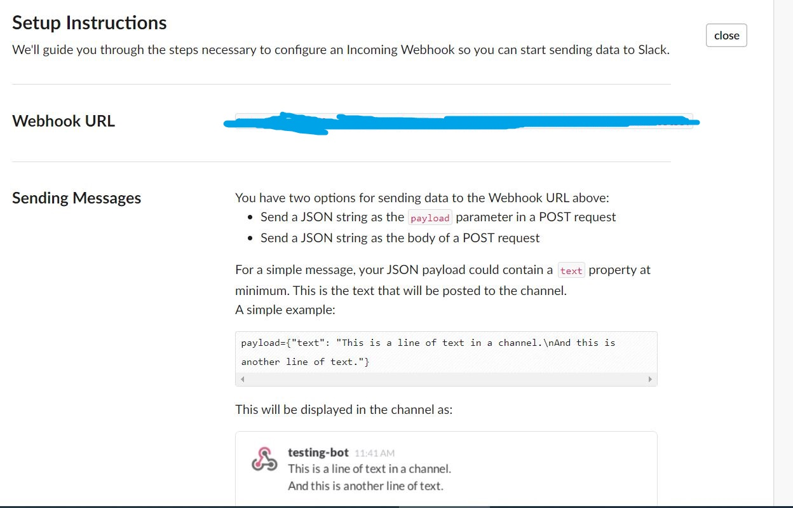

당연히 이 Webhook URL이 다른 사람에게 알려지면 안 되겠죠?

화면을 아래로 쭉 내려보면 Example이라고 해서 어떻게 데이터가 Posting 되는지 시험해볼 수 있는 API가 있습니다.


한번 시험해볼까요? 해당 코드를 복사한 뒤 터미널 창에 붙여넣기 해보겠습니다. 다음과 같이 채널에 메시지가 잘 전달된 걸 보실 수 있을 겁니다.

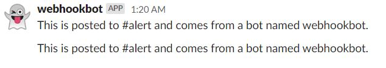

## 6. Edit the Crawler

Webhooks설정까지 마쳤으니 본격적으로 Github Action으로 들어가보겠습니다. 그 전에 크롤러에 다음과 같은 코드를 추가해주세요.

```python
url = os.environ.get('SLACK_URL')

def slack_post_text(url, text):
    result = requests.post(url, json = {"text": text})
    return result
```

Webhooks를 설정하면서 Webhooks URL은 다른 사람에게 보여선 안된다고 했습니다. 그렇기 때문에 우리는 이 URL을 SLACK_URL이란 환경변수로 지정해서 다른 사람에겐 보이지 않되 코드에선 변수를 가져와 사용할 수 있도록 만들어줄겁니다.

그리고 slack_post_text라는 함수를 통해 슬랙에 보내고자 하는 메시지를 JSON으로 URL에 전달해줍니다.

## 7. Configure GitHub Repository Settings

GitHub 저장소 하나를 만들어준 뒤, 크롤러를 저장소에 push 해주세요. 그리고 우리가 그토록 기다리던 **GitHub Action**을 진행하기 위해 저장소 메뉴 중 Pull requests 오른쪽에 있는 Action을 클릭해주세요.

라고 하고 싶지만, 우리에겐 조금 더할 일이 남아있습니다. 환경변수를 지정해줘야 한다고 했던 거 기억하시나요?

맞습니다. 그 환경변수를 지정해보도록 하겠습니다.

Settings에 들어가 주시고 아래 하늘색 표시해놓은 것처럼 Secrets를 클릭해주세요.

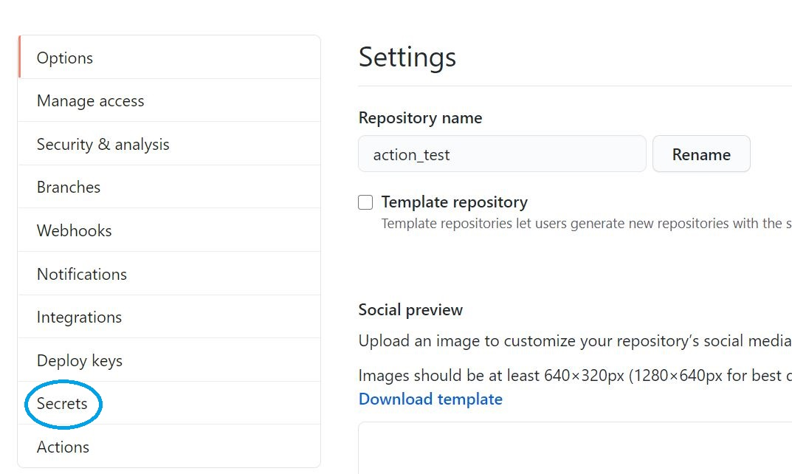

왠지 뭘 해야 할지 감 오시죠? 맞습니다. New secret 버튼을 눌러주세요.

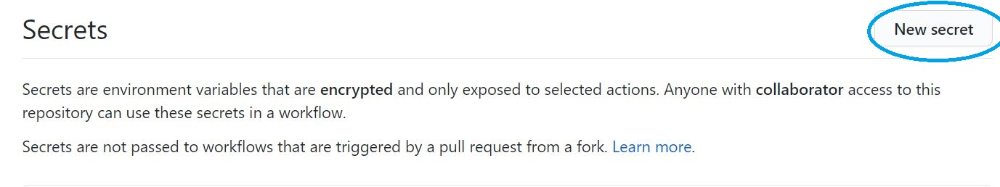

Name엔 전에 말씀드렸던 SLACK_URL을 입력해주시고, Value에 Webhooks URL을 입력해주신 다음 추가해주세요.
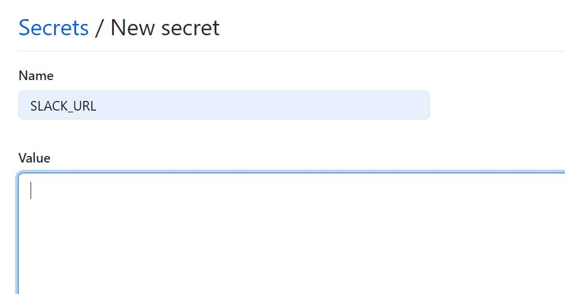

## 8. Make a GitHub Action

**드디어** 정말 우리가 기다리고 기다리던 GitHub Action을 할 시간입니다.

GitHub Action에 관한 글인데 뭐가 이렇게 많냐고요? 뭐 어쩔 수 없습니다.


데이터 분석을 배울 때 거의 귀가 닳도록 듣는 말이 전처리에 전체 프로젝트 중 80%의 시간을 쏟는다는 얘기인데, Github Action도 마찬가지인 듯 합니다. 환경설정을 해줘야 할 게 많이 있어서 시간이 오래 걸렸습니다.

각설하고, 여기서는 크롤러를 python으로 만들었다고 가정하겠습니다.

하늘색 표시를 해놓은 Python application에서 Set up this workflow를 클릭해주세요.

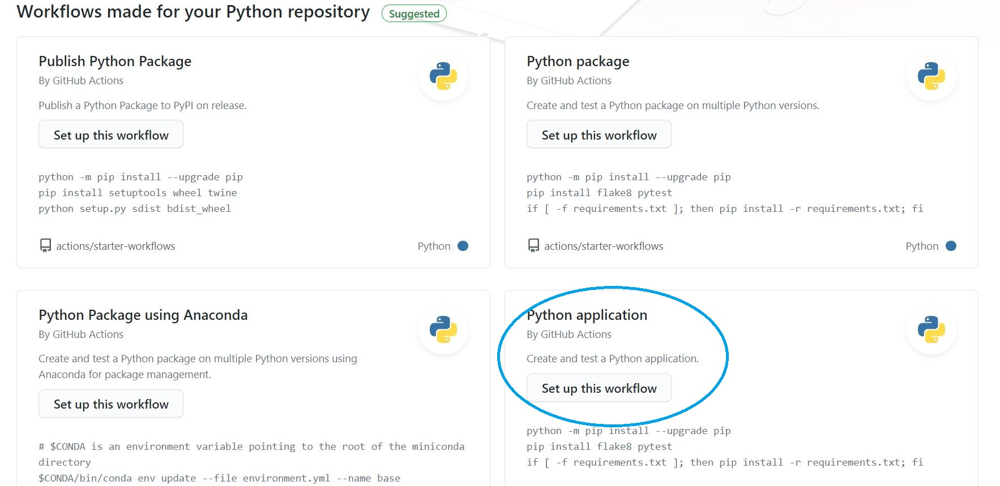

workflow 내용을 다음과 같이 바꿔주세요.

```yaml
name: Python application

on:
  schedule:
  - cron: "5 0 * * *"
  workflow_dispatch:
    inputs:
      logLevel:
        description: 'Log level'
        required: true
        default: 'warning'
      tags:
        description: 'Test scenario tags'

jobs:
  build:

    runs-on: ubuntu-latest

    steps:
    - uses: actions/checkout@v2
    - name: Set up Python 3.8
      uses: actions/setup-python@v2
      with:
        python-version: 3.8
    - name: Install dependencies
      run: |
        python -m pip install --upgrade pip
        pip install bs4 requests
    - run: python 크롤러이름.py
      env: # Or as an environment variable
        SLACK_URL: ${{ secrets.SLACK_URL }}
```

## 9. Edit workflow

특히 들여쓰기에 유의해주세요. 파이선을 해보셨다면 아시겠지만, 들여쓰기 하나 때문에 빨간색 에러가 발생하곤 합니다. 위의 8번 챕터에서는 코드 설명 없이 우선 고치라고 말씀드렸는데 여기서 하나하나 설명해 드리도록 하겠습니다. 우선 **on** 부분을 보겠습니다.

```yaml
on:
  schedule:
  - cron: "5 0 * * *"
  workflow_dispatch:
    inputs:
      logLevel:
        description: 'Log level'
        required: true
        default: 'warning'
      tags:
        description: 'Test scenario tags'
```

**schedule** 밑에 있는 cron은 언제 해당 크롤러를 작동시킬지에 대한 내용입니다. 이에 대한 문법을 다 외우시는 것보다는 [crontab.guru](https://crontab.guru/)라는 사이트를 방문해서 원하시는 날짜설정을 하시길 권해드리고 싶습니다. 주의할 사항은 설정되는 시간이 UTC(협정 시계시)기준이라는 겁니다. 한국은 UTC+9를 설정해줘야 한다는 점을 유의해주세요.

**workflow_dispatch**부분은 해당 action이 작동하는지 작동하지 않는지 확인하기 위해 수동으로 Github Action을 작동시킬 수 있도록 해주는 코드입니다.

그럼 다음으로 **jobs**를 보겠습니다.

```yaml
jobs:
  build:

    runs-on: ubuntu-latest

    steps:
    - uses: actions/checkout@v2
    - name: Set up Python 3.8
      uses: actions/setup-python@v2
      with:
        python-version: 3.8
    - name: Install dependencies
      run: |
        python -m pip install --upgrade pip
        pip install bs4 requests
    - run: python 크롤러이름.py
      env: # Or as an environment variable
        SLACK_URL: ${{ secrets.SLACK_URL }}
```

대강 눈치채실 수도 있겠지만, runs-on을 보면 GitHub Action이 우분투 환경에서 작동한다는 것을 알 수 있습니다.

**- name: Install dependencies** 이 부분에선 익숙한 pip install이 등장합니다. 필요한 라이브러리가 있으시다면 추가해주세요.

마지막으로 **run** 부분에 크롤러를 실행할 수 있도록 해주시고 **env**에는 그토록 강조했던 SLACK_URL 환경변수를 입력해줍니다.

그렇게 한 뒤 화면 우상단에 있는 Start commit 버튼을 누르고 커밋해주세요.

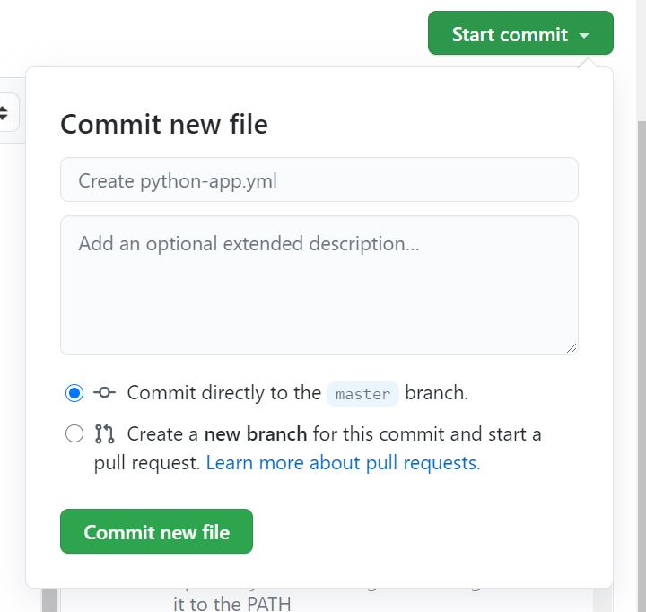

## 10. Test GitHub Action

이제 테스트를 한 번 해보겠습니다.

GitHub 저장소에서 Action 메뉴를 클릭해주세요. 그리고 하늘색 표시해 준 Python application을 클릭해주세요

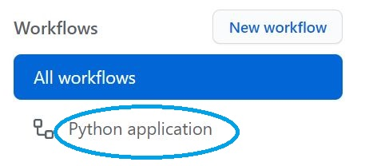

잘 작동하는지 아닌지 수동으로 확인해보겠습니다. Run workflow를 실행해주세요.

그럼 슬랙 채널에 다음과 같이 메시지가 도착했음을 보실 수 있을 겁니다.

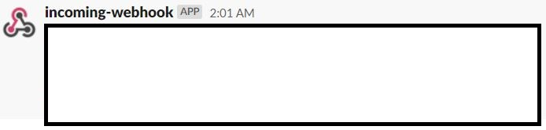

여기까지 GitHub Action을 이용한 Slack 알림 자동화를 해보셨는데 어떠셨나요?

많이 어려우셨나요? 그렇죠? 맞아요. 저도 많이 어렵더라고요.

하지만 안되면 될 때까지, 계속해서 해보거나 [딥백수 슬랙](https://bit.ly/2Sqdnws)에 오셔서 질문해주시면 다른 구성원분들이 많이 도움을 주시지 않을까 생각을 합니다.

사실 이 글을 쓰는 저는 컴맹에 가까운 수준이라 많이 어렵더라고요. 하나하나 이해하는 데 시간이 얼마나 많이 걸리던지... 그렇게 헤매던 저를 인내심을 가지고 가르쳐주신 Mo Kweon님께 감사하다는 말을 마지막으로 남기고 싶습니다.

긴 글 읽어주셔서 고맙습니다.
