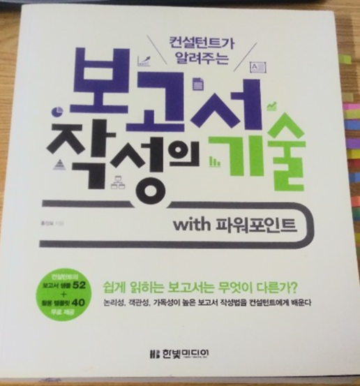
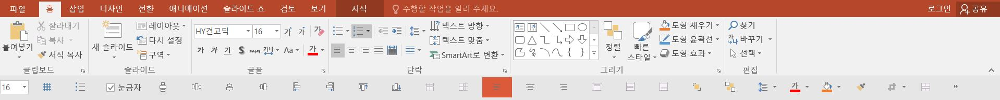
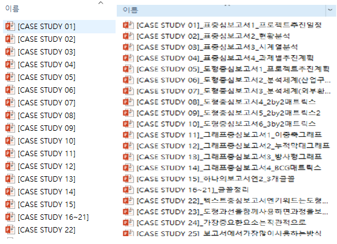

## 나는 PT고자였다 - 경영학개론

대학교 1학년 첫 경영학개론 시간. 당연히 긴장 반 설렘 반으로 가득한 시간이었다. 자기소개를 마치고 학교 소개와 교과목 소개가 얼추 끝났을 때 교수님은 알아서 팀을 구성하라고 하셨다. 처음엔 다들 수줍어 하더니, 잠시 후 조금씩 모이고 팀을 구성해나갔다. 그 중에서도 가장 높은 수요를 받는 사람은 'PT 잘만드는 사람'이었다. 스타트업에서 개발자의 수요와 연봉이 높듯, 대학교 수업시간에서 가장 수요와 관심을 받는 사람은 'PT 잘만드는 사람'이었다. 이들을 영입하기 위해서 '자료조사 열외', '팀회의 열외'를 내건 사례들도 왕왕 있었다. 디자인만 잘해주면 된다는 마인드였기 때문이다.

일반적으로 공대생들보다는 경영대생이, 경영대생보다는 디자인학과생이 PT를 잘 만드는 경향이 있어 수요가 높은 편이었는데, 나는 전혀 아니었다. 애들끼리 얘기할 때 용어로 'PT고자'였다. 깔끔하면서도 예쁘게 만드는 다른 친구들과 달리, 마치 초등학생이 스케치를 한 듯, 졸라맨을 그린듯 ppt디자인에 자신이 없었다. 그런 이유인지 몰라도 ppt를 복잡하게 구성하는 걸 싫어하는 편이었고 지금도 그렇다.

가이 가와사키의 [10/20/30룰](https://guykawasaki.com/the_102030_rule/) 을 좋아하게 된 건 그의 주장이 마음에 들어서이기도 하지만, 내가 가진 이런 약점 때문이기도 하다.

자료조사와 논리 세우기 그리고 PT내용을 어떻게 구성할건지, 시간과 노동이 많이 들어가는 핵심파트를 다 맡아도 마지막 PT제작을 해줄 사람이 없으니 답답할 때가 많았다. 하지만 그런 약점을 개선하려는 노력을 별로 하지 않았다. 이유는 내 약점이기 때문에 쳐다보기 싫었던거 같다.

## 약점과 마주해야 할 시간

어느 날, xx의 데이터 분석 미니 프로젝트를 맡을 일이 있었다. 어찌저찌 분석을 했고 보고서를 작성해서 제출했는데, 다시 해오라는 대답을 들었다. 내가 봐도 심했긴 했다. 차트도 삐뚤삐뚤. 뭔가 일관성 있어보이지 않고 이건 비즈니스 보고서는 커녕 대학교 1학년 과제 제출 수준보다도 못했으니까.

그런데 그 때도 템플릿을 인터넷에서 구해서 어찌저찌 넘어가는 수준으로 모면했다. 약점과 마주해야 할 시간이었지만 굳이 마주하고 싶지 않았다. 하지만 분석가로 일하겠다면서 PT작성을 못한다는 건 말이 안되는 일이었고 시간은 흘러 다시한번 오더가 떨어졌다.

'진영님 ~~~ 정리해서 보고해주세요.'

그 때 이 책을 잡았다. 시간이 좀 걸리더라도 제대로 한 번 공부해봐야겠다고 생각했기 때문이다.

다른 PT책도 많은데 이 책을 본 이유는 첫째로 복잡한 디자인을 단시간에 배우는 건 힘들다고 생각했고 둘째로 컨설턴트들이 깔끔하면서도 가장 비즈니스적인 PT를 만드는 능력이 있기에 그걸 배우고 싶었기 때문이다.

내가 배우고 싶은 건 비즈니스 PT 제작 능력이지, 눈이 띠용할 만큼 아름다운 디자인을 PT에 넣는 능력이 아니기 때문이다.

이 책은 이런 요구사항을 충족시켜준 책이다.

어쩌면 가장 기초 중 기초라고 할 수 있는 메뉴들부터 하나하나 차근차근 설명한다. 너무 당연하다고 생각할 수 있는데 의외로 있는지도 모르는 기능들이 많았다. 그리고 컨설팅을 하시는 분들은 그런 기능을 자주 활용한다고 하셔서 노하우를 배울 수 있었다.

색깔 하나, 글꼴 하나, 줄 간격 하나에도 보는 사람이 어떻게 인식할지 고민한 흔적들이 녹아있었다. 그저 결과물만 봤을 땐 몰랐던 이야기였다. 사실 한빛미디어 홈페이지에 가보면 저자가 만들어놓은 템플릿을 무료로 제공하기 때문에 결과물 Templates만 보고 싶다면 이런 건 별로 보지않아도 된다. 아니 책을 별로 보지 않아도 상관없다. 홈페이지에 가서 템플릿을 다운로드하기만 하면 되니까.

내가 집중한 건 '어떤 이유'로 '어떤 생각'으로 PT를 만들어 나가는지, 어떤 기능을 활용하는지. 그 과정이었다. 결과만 보는 건 인터넷 템플릿 다운받는 것 이상의 의미가 없으니까.

<<<<<<< HEAD
아래 사진을 보자

파워포인트의 메뉴 화면인데, 비슷하면서도 뭔가 추가된 느낌을 받을 것이다. '빠른실행도구'라는 기능인데, 이미 안 사람도 있겠지만, 나는 이런 기능이 있는지 전혀 알지 못했다.

메뉴에 이미 다 기능이 있는데 '왜' 굳이 귀찮게 또 추가를 해야하는지 물어볼 수도 있을거 같다. 반갑다 동지! 나도 처음엔 그런 의문을 품었다.

이 기능을 사용하는 이유는 3가지 이유가 있다. 다음 사진을 보자.

뭔가 달라졌음을 당연히 느꼈을 것이다. 우리가 보는 일반(리본)메뉴를 축소시킨 뒤 빠른실행도구만 남겨놓았다.

여기서 첫 번째 이유가 나오는데, 저자같은 컨설턴트는 작은 노트북 화면에 의존해서 PT 슬라이드를 만드는 경우가 많다고 한다. 저자의 경험에 따르면 화면이 작을 경우 오타를 찾기 힘들거나, 디자인에서 결함이 있는 부분을 찾기 힘들기 때문에 최대한 화면을 넓게 사용해야 높은 품질의 슬라이드를 만들 수 있다고 한다. 지금 내가 작업하고 있는 환경은 듀얼 모니터를 사용해서 작업을 하기에 당장은 적용되지 않는 이유지만, 만약 나도 저자처럼 노트북 화면 하나에 의존할 때가 오면 활용할 수밖에 없다고 생각했다.

둘째로 위 사진에 보면 파란색 동그라미 표시를 해놓은 '맨 앞으로 가져오기', '맨 뒤로 보내기'와 같은 기능은 PT슬라이드를 만들거나 수정할 때 자주 사용하는 기능이라 하나하나 찾는 수고를 덜어야 소요시간을 줄이고 업무효율성을 높일 수 있다. 슬라이드를 만들어본 사람이라면 알텐데, 단순한 디자인의 간단한 슬라이드 제작이라고 하더라도 결과물이 단순한 거지, 제작시간이 짧은 건 아니다. 특히 다른 사람에게 보여주고 평가받아야 하는 슬라이드의 특성상 텍스트 상자, 도형, 줄 간격 할 것없이 섬세하게 다듬어야 하기 때문에 효율성을 높이는 건 필수라고 생각한다.

마지막으로 빠른실행도구에 들어갈 기능을 자기에 맞게 한번 설정한 뒤 설정파일을 저장해놓으면 다른 컴퓨터를 사용하더라도 설정파일을 불러와서 똑같은 빠른실행도구를 사용할 수 있다. 프로그래밍으로 치면 자기만의 라이브러리, 함수를 저장해놓는 것과 비슷하다.

어떤가? 단순히 빠른실행도구라는 결과물만 보면 배울 점은 보이지 않던게 보이기 시작하지 않는가?

=======

> > > > > > > origin/source
> > > > > > > 
> > > > > > > 바퀴를 재발명하지 마라
> > > > > > > 

유명한 프로그래밍 격언이다. 이 책의 장점 중 하나는 책에서 나온 템플릿(실습하지 않은 템플릿 포함)을 무료로 제공한다는 점이다. 프로그래밍에서 라이브러리를 import해서 사용하듯, 좋은 템플릿이 있다면 굳이 또다시 새로 만드는 시간 낭비할 이유는 없다. 공부한 걸 바탕으로 각 상황에 맞게 필요한 템플릿에서 복사 + 붙여넣기 하면 될 일이다.

다만 이 책에선 몇 가지 단점이 있기 때문에 그 점에 유의해야 한다.

비즈니스 보고서에서 가장 핵심적으로 다루는 누적막대그래프에 대한 실습 데이터를 모든 실습에 제공하지는 않는다. 또한, 실습에서 다루는 선그래프에 대해서도 템플릿을 제공하지 않는다. 이 점이 무척 아쉬웠다. 이럴 때 thinkcell이란 사용하면 PT에서 누적막대그래프를 그리거나 다른 시각화를 할 때 매우 편리한데, 이건 유료프로그램이라 보통 컨설팅을 하시는 분들 위주로 사용한다고 알고 있다. 차선책으로는 태블로나 Power BI 같은 BI툴을 활용해서 그래프를 작성한 뒤 슬라이드에 넣는 방법이 있을 것 같다.

그리고 보고서 템플릿 제공파일을 살펴보니 다음 사진의 왼쪽 사진처럼 어떤 내용인지 설명을 넣지 않았다. 나중에 활용을 위해선 해당 템플릿이 어떤 템플릿인지 알아야 상황에 맞게 즉각적으로 사용할 수 있기 때문에 직접 일일이 다 이름을 수정해야했다.

조금 더 독자 지향적으로 자료를 제공했다면 어땠을까 하는 아쉬움이 있다. 그래도 이 책 덕에 데이터 분석을 한 뒤에 어떻게 커뮤니케이션 해야 하는지, 색채 하나, 명도 하나에도 사람들의 인식이 많이 바뀔 수 있음을 배웠다. 특히나 경험이 많은 시니어에게 과외를 받듯 배울 수 있어서 즐거운 독서였다. 데이터 분석을 하는 사람이든 아니면 일반 직장인이든 대학생이든 일독을 권하고 싶다.
